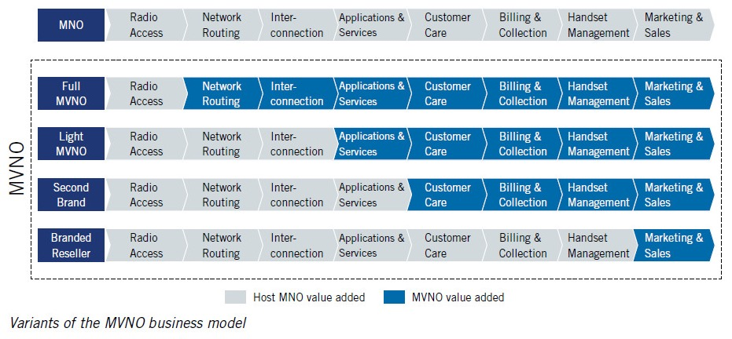

# MNO

* `MNO`
  * =`Mobile Network Operator`=`移动网络运营商`
    * =`Mobile Operator`=`移动运营商`
  * 概述
    * Variants of the MVNO business model
    * 
  * 常见
    * 国外
      * Vodafone
      * Verizon
      * T-Mobile
      * Orange
      * Telefonica
    * 中国国内
      * 中国移动
      * 中国联通
      * 中国电信
  * 职责
    * 需要维护
      * OSS=Operation Support System
      * BSS=Business Support System
* 相关
  * `MVNO`
    * =`Mobile Virtual Network Operator`=`移动虚拟网络运营商`
      * =`虚拟运营商`
    * 常见
      * 国外
        * Virgin Mobile
        * Lyca Mobile
        * Walmart Mobile
        * Lebara Mobile
      * 国内
        * 蜗牛移动
  * MVNA=Mobile Virtual Network Aggregator
  * MVNE=Mobile Virtual Network Enabler