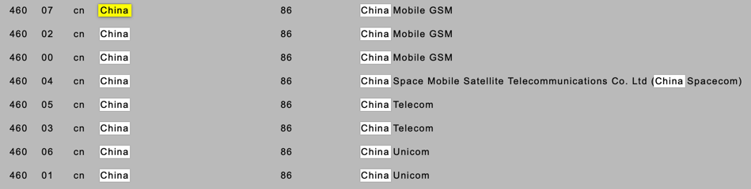

# MSIN

* MSIN
  * 全称
    * =Mobile Subscription Identification Number=国际移动用户识别码
    * 有时候也写成：Mobile Subscriber Identification Number
  * 别称
    * MIN=Mobile Identification Number
    * MSID=Mobile Station ID
    * IMSI_S=Short IMSI
  * 作用
    * MNO用来区分移动手机（用户）的
  * 特点
    * 唯一的
  * 数值
    * 最多包含10个数字
      * 15位的IMSI，取最后10位
        * the last 10 digits of the 15 digit long IMSI number are the MSIN

