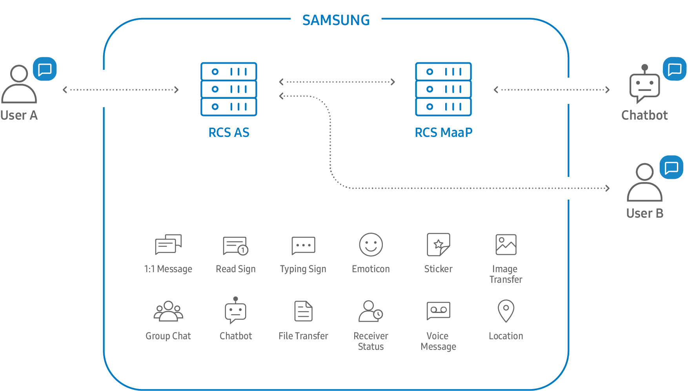

# 找RCS服务商

想要开发RCS应用，可以借助已有的，可以提供RCS方案的服务商=供应商，去整合出自己的应用。

此处列出一些可供参考的服务商，或者是RCS生态相关的各方资源。

* Samsung
  * Samsung RCS Developers
    * https://rcs.developer.samsung.com
  * Samsung RCS chatbot
    * https://rcs.developer.samsung.com/develop/Introduction/overview.html
  * Samsung RCS ecosystem
    * https://rcs.developer.samsung.com/develop/Introduction/Samsung%20RCS%20ecosystem/RCS-chatbot-ecosystem.html
      * 架构
        * 
  * Samsung Bot SDK API
    * https://rcs.developer.samsung.com/develop/Development/Javascript%20chatbot%20development/API%20reference/javascript-chatbot-api-reference.html
* Oracle
  * Developing Rich Communication Services Applications
    * https://docs.oracle.com/cd/E55119_01/doc.71/e55126/wd_rcsapps.htm#WSEWD363
* VoipSwitch
  * RCS SDK
    * 主页
      * Rich Communication Suite software development kit
        * http://www.voipswitch.com/products/voip-softphones/rcs-sdk/
    * 简介
      * The Softphone Software Development Kit (SDK) provides a comprehensive framework by which a solution developer can quickly build their own RCS applications and benefit from all the functionalities of our whitelabel RCS products.
    * 平台
      * iOS
      * Android
    * 主要功能特性
      * Built in media stack
      * SIP signaling stack
      * Presence
      * Chat and group chat
      * High Definition audio and video codecs including OPUS, VP8 and others
      * ICE framework with TURN support for the most effective NAT traversal and peer to peer media connectivity
      * Secure VoIP – TLS encryption and SRTP for media
      * Ready to use examples for Android Studio and Xcode
* Sinch
  * RCS HTTP REST API - Sinch Documentation For Developers
    * https://developers.sinch.com/docs/rcs-http-rest
