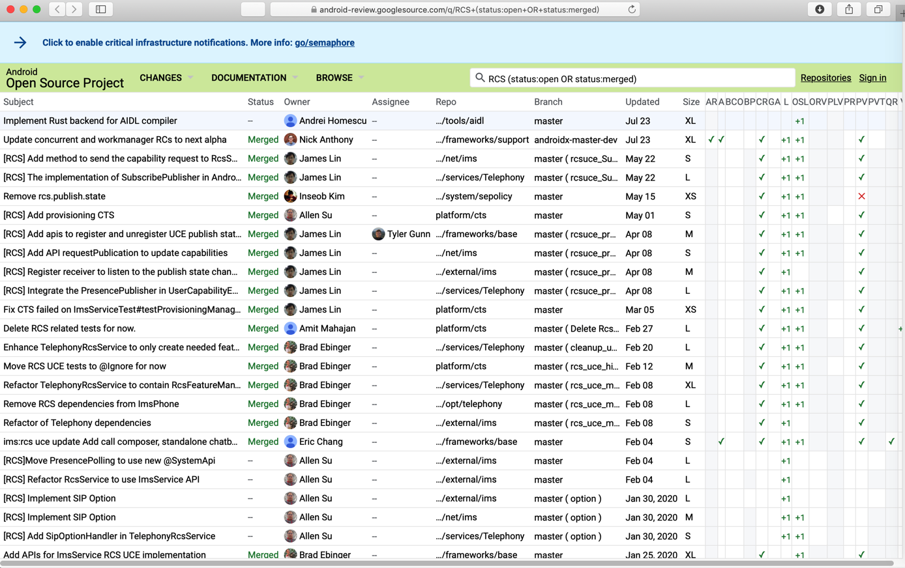
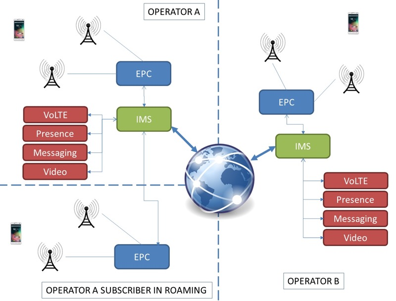

# Google

Google也对RCS支持的很好。

如果需要开发RCS，可以考虑直接用Google相关平台和服务。

* Google
  * 概览
    * `Messages`
      * 支持RCS消息：Chat features=聊天功能
    * `Jibe`=`Jibe Platform`
      * 主页：https://jibe.google.com/jibe-platform/
      * 包含
        * `Jibe Cloud`
          * 概述
            * Easily launch and manage RCS services with Google-hosted infrastructure
            * The Jibe Cloud can help carriers quickly scale RCS services, iterate in short cycles, and benefit from improvements immediately. A GSMA-certified, hosted service, the Jibe Cloud supports clients that implement the Universal Profile across leading smartphone platforms.
        * `Jibe Hub`
          * 概述
            * Access the global RCS network with one connection
            * The Jibe Hub provides mobile operators with a simple connection to the global RCS network. Easily interoperable with third-party RCS networks, one connection delivers worldwide interconnection
  * RCS开发
    * RCS Business Messaging  |  Google Developers
      * https://developers.google.com/business-communications/rcs-business-messaging
    * Business Messaging (B2C)
      * https://jibe.google.com/business-messaging/
    * IMS
      * 实现 IMS  |  Android 开源项目  |  Android Open Source Project
        * https://source.android.com/devices/tech/connect/ims
          * Android 9 引入了一个名为 ImsService 的新 SystemApi 接口，可帮助您实现 IP 多媒体子系统 (IMS)。ImsService API 是在 Android 平台与供应商或运营商提供的 IMS 实现之间明确定义的接口。
    * google的源码中已包含部分RCS功能了？
      * [Android 11 RCS API? : UniversalProfile](https://www.reddit.com/r/UniversalProfile/comments/dysikj/android_11_rcs_api/)
      * ->
      * [RCS (status:open OR status:merged) · Gerrit Code Review](https://android-review.googlesource.com/q/RCS+(status:open+OR+status:merged))
        * 
    * google用RCS实现WhatsApp的功能 架构图
      * 
