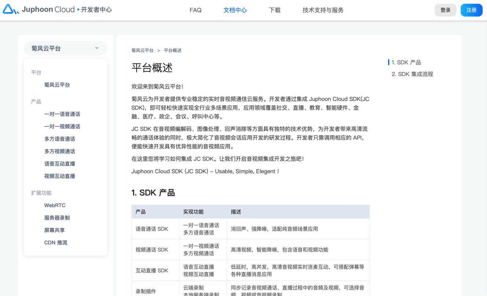
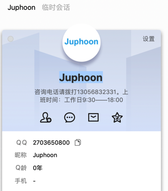

# 菊风

国内的RCS服务商，做的比较专业的有：菊风。

* 菊风
  * 官网
    * https://rcs.juphoon.com/cn/
  * RCS SDK
    * https://rcs.juphoon.com/cn/products/rcs-sdk.html
      * 英文
        * https://rcs.juphoon.com/en/products/rcs-sdk.html
  * Chatbot 开放平台
    * https://rcs.juphoon.com/cn/products/chatbot.html

## 如何用菊风开发RCS？

* **问**：想要用菊风去开发RCS，如何操作？
* **答**：需要单独联系合作 暂无SDK下载
  * QQ：`2703650800`
  * 咨询电话：`13056832331`
* **研究过程**：

目前已有的官网下载

[菊风能力开放平台（beta）](https://download.juphoon.com/?language=cn)

其实只是VoIP的SDK，文档也是VoIP，SIP相关的文档：

* 下载 Juphoon VoIP 控件化SDK
  * VOIP_SDK 控件化集成指南 Android 版
    * http://download.juphoon.com:8083/SDKCapOpen/doc/voip_sdk_doc_android/juphoon-voip-sdk-user-manual-android.pdf
* 下载 Juphoon VoIP客户端App
  * JusPhone for iOS 用户手册
    * http://download.juphoon.com:8083/SDKCapOpen/doc/jusphone_for_ios/jusphone_for_ios.pdf

而不是RCS的文档

以及目前平台：菊风云平台

主要也都是 音视频相关的

[菊风云开发者网站](https://developer.juphoon.com/cn/document/V2.1/index.php)

暂没找到RCS相关内容

通过

[菊风融合通信-5G消息|RCS商业富媒体消息标准技术解决方案提供商](https://rcs.juphoon.com/cn/products/chatbot.html) -> `Chatbot 开放平台` -> 立即咨询

找到了联系方式：

* QQ：`2703650800`
* 昵称：Juphoon
* 咨询电话请拨打：`13056832331`
* 上班时间：工作日9:30——18:00

需要的可以去联系。