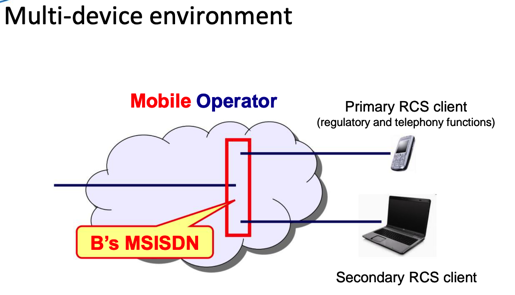
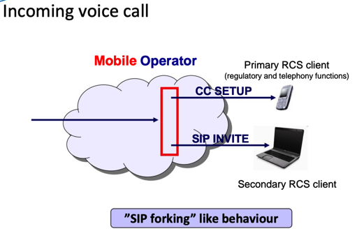
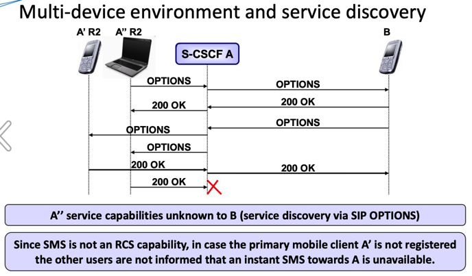
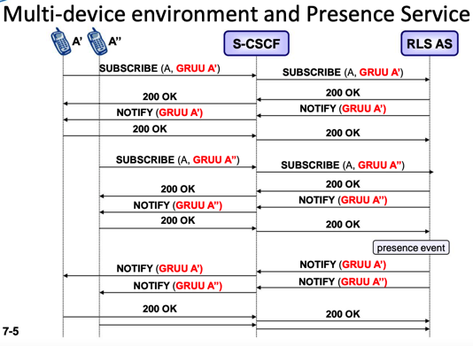
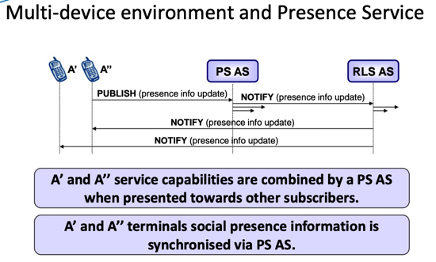
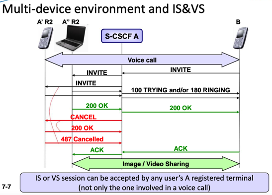
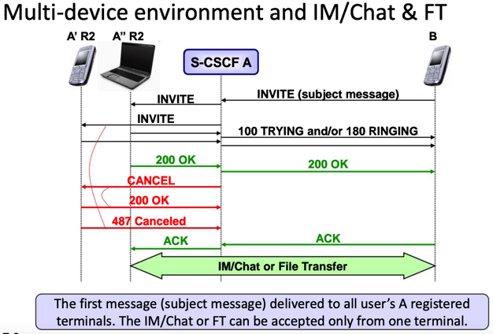

# RCS开发基础知识

进行RCS开发之前，需要搞清楚很多基础知识，包括但不限于：

* RCS的基本功能
* 相关各种组织、协议规范
  * 有哪些协议规范
    * 分别是哪个组织制定的
    * 大概作用是什么
    * 各个组织之间的关系如何
* RCS的各个版本
  * 有哪些版本
  * 分别对应着哪些缩写、简写
* RCS的核心架构
  * 以及所依赖的`IMS`的架构

## RCS的功能组成

从功能角度来说：

* 基于IMS
  * 利用了IMS的控制功能，实现了丰富的多媒体服务产品组合
    * 多媒体消息multimedia messaging
    * 聊天chat
      * 单聊
      * 群聊=组聊
    * 文件发送file transfer
    * 隐私privacy
    * 好友列表buddy lists
    * 状态 presence
    * 能力发现capability discovery
      * 使得用户得以知道其好友支持哪些功能
        * 利于选择合适的通信方式与其沟通
        * 避免了各种错误和尝试，提升了用户体验
      * 实现了
        * 互操作性interoperability
        * 可触达性reachability
        * 不同用户之间的无缝通信

可以总结为：

* `RCS` = `IMS` + `其他`
  * 其他：
    * 认证 authentication
    * 授权 authorization
    * 注册 registration
    * 收费 charging
    * 路由 routing

## RCS涉及多方

* 为了实现RCS，涉及到
  * 多方
    * 运营商=网络运营商=移动网络运营商=MNO
    * 服务提供商=SP
  * 网络相关
    * 寻址addressing
    * 信号处理signalling
      * 包括
        * 运营商网络
          * 内部=intra：intra-operator
          * 之间=inter：inter-operator

## 运营商部署RCS

* 部署
  * 不同运营商部署RCS的方案不同
    * 举例
      * 在VoLTE之前就部署RCS消息服务
        * 用于满足用户对于多媒体消息的需求
          * 面对智能手机时期的OTT的各种应用的竞争

## RCS多设备支持

* RCS 多设备环境
  * 多设备环境
    * 
  * 接入语音电话
    * 
  * 多设备环境和服务发现
    * 
  * 多设备环境和存在服务
    * 
    * 
  * 多设备环境和IS&VS
    * 
  * 多设备环境和 即时通讯/聊天/文件传输
    * 

## 常见问题

### 手机没SIM卡能支持RCS吗？

* 答：可以
  * 详见：
    * https://www.gsma.com/futurenetworks/wp-content/uploads/2015/03/RCS5.3_UNI.zip
      * -》 RCC.07 v6.0.pdf
        * For the configuration of additional RCS capable devices (i.e. devices not carrying the SIM associated with a subscriber’s main identity)
          * 意思应该就是：没有SIM卡的手机，理论上也可以支持RCS的
