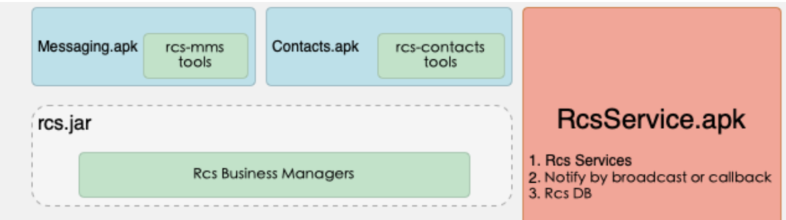
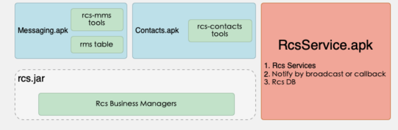
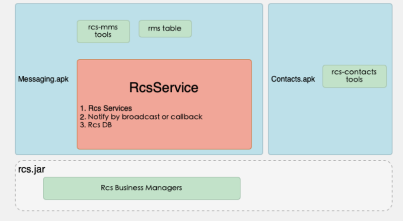
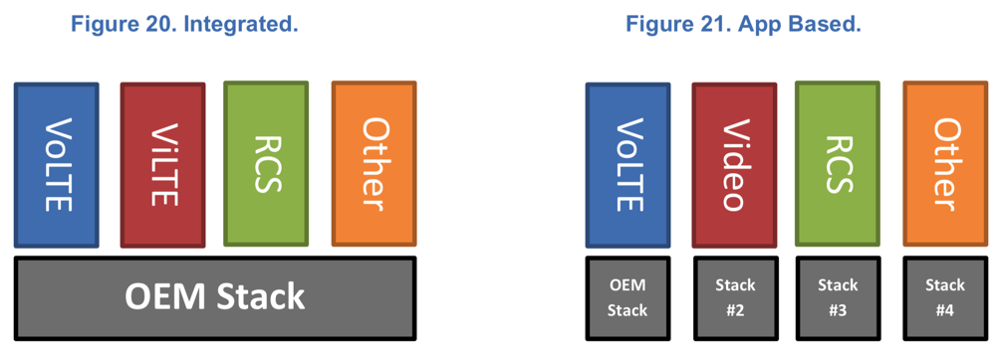

# RCS具体实现

关于RCS具体的实现，实施，有多种方式。总结如下：

* RCS Native
  * 菊风 三大方案
    * 方案一：主要包含 `RCSService`（`RCS`服务）；`TelephonyProvider`（系统短彩数据库）；`Messaging/Mms Contacts`
      * 代表性案例：`海信`、`小米`、`酷比`、`天珑`
      * 架构：
        * 
      * 细节
        * 针对这些手机厂商的方案，牵扯到了系统应用，菊风在其系统上增加`RCSService.apk`
        * 改造原短彩信的数据库，升级`MaaP`需整个系统升级即可实现
        * 但由于`service.apk`是系统级应用保证常驻，能够长时间保留信息
        * 改动短信应用会在系统上增加`RCSService.apk`，修改系统短信的数据库
    * 方案二：针对不想修改`TelephonyProvider`源码的用户，在该场景下`RCSService`不处理任何数据库操作，上层可以在收到广播后进行数据的存储
      * 代表性案例：`联想`、`360`
      * 架构
        * 
      * 细节
        * 菊风为联想、360提供的`RCS Native`解决方案并不改造系统数据库，只需添加`service.apk`，再改造短信应用即可完成
    * 方案三：一般是在方案2的基础上将`RCSService`代码打成`aar`包供上层直接集成，确保集成该`aar`应用存放在`system/priv‒app/`下
      * 代表性案例：`OPPO`、`魅族`
      * 架构
        * 
      * 细节
        * 菊风为 OPPO 和魅族提供sdk助其短信集成，不会修改系统中的其他任何应用，包括数据库、服务增加等；用户只需升级短信应用即可提供 MaaP 的相应能力，魅族本身短信应用快速升级十分方便，升级代价最小；只改动短信应用
* RCS消息
  * 美国
    * 
