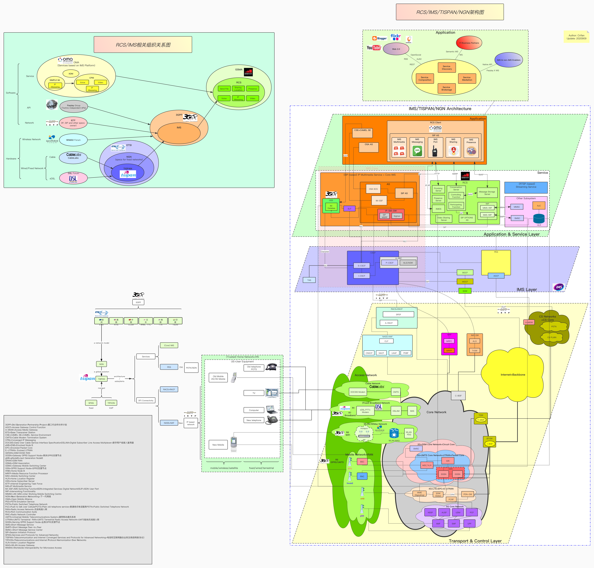
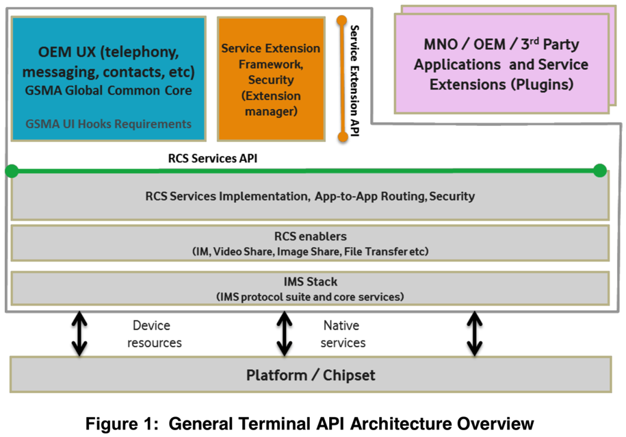
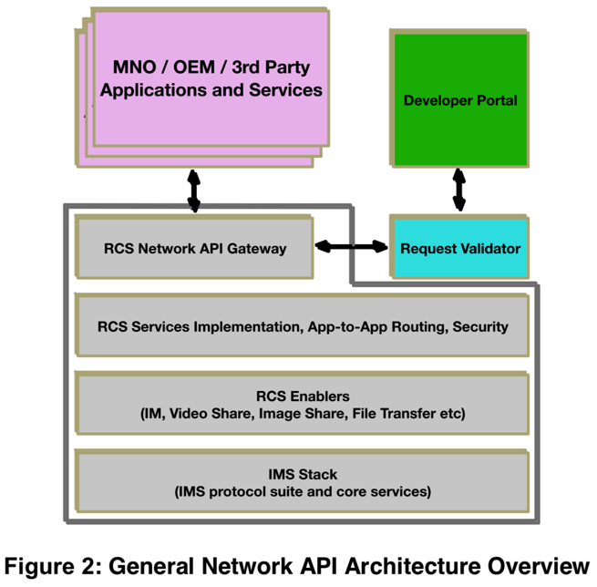
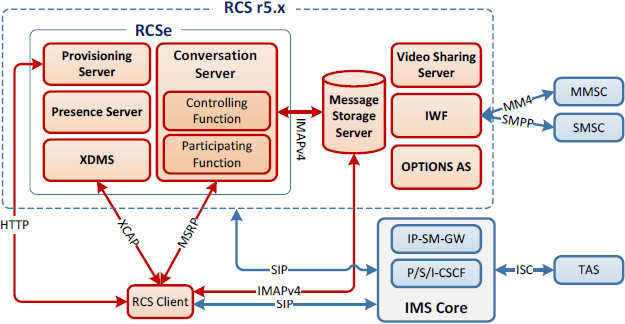
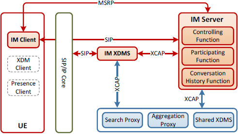
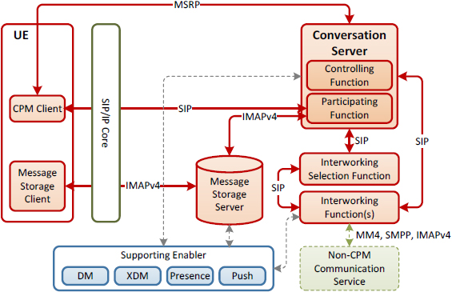
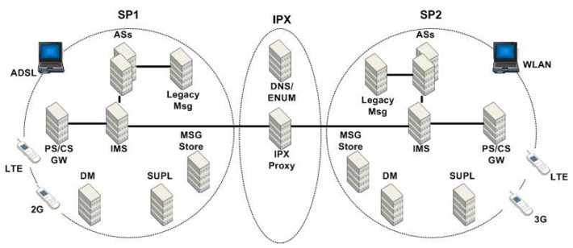
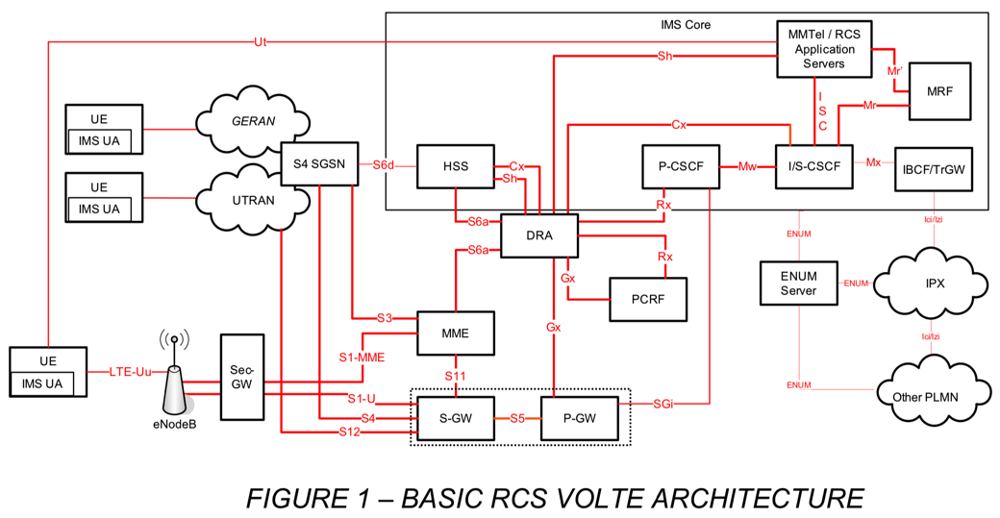

# RCS技术架构

`GSMA`制定的`RCS`技术(规范)，主要基于`IMS`技术(规范)

而`3GPP`制定的`IMS`，是从侧重固定网络的`TISPAN`演化而来。

而`TISPAN`则是`ETSI`的`NGN`架构的一种具体实现。

关于`RCS`和`IMS`相关的**各种组织机构的关系**，以及`RCS`和`IMS`及相关的`NGN`和`TISPAN`的**架构**，见下图：

* RCS/IMS/TISPAN/NGN架构和相关组织关系图
  * 图
    * 
  * 在线查看
    * RCS/IMS/TISPAN/NGN架构和相关组织关系图 | ProcessOn免费在线作图
      * https://www.processon.com/view/link/5f48c086f346fb2e2959bfbb

## API架构

* TAPI：General Terminal API Architecture Overview
  * 
* NAPI：General Network API Architecture Overview
  * 

## 参考的RCS架构

整理出参考过的一些RCS架构相关资料：

* RCS
  * RCS Architecture 5.x
    * 
    * 之前架构
      * SIMPLE IM Architecture
        * 
      * CPM Architecture
        * 
  * 采用了CPM后的RCS架构
    * Adoption of CPM architecture in RCS - Overall RCS architecture
      * 
* VoLTE
  * Basic RCS VoLTE Architecture
    * 
