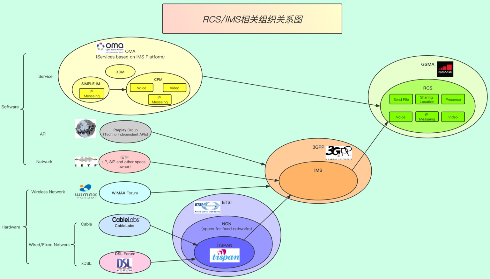

# RCS和其他

概览：

## RCS和其他组织的协议关系

* 3GPP
    * TS 24.229
      * IMS procedure
    * `TS 22.340`
      * = `IMS spec`
      * `v15.0.0`
        * https://www.3gpp.org/ftp/Specs/archive/22_series/22.340/22340-g00.zip
    * TS 24.341
      * SMS over IMS and SMS over SGs for a cohesive SMSoIP
        * SMSoIP=SMS over IP
* GSMA
  * 概述
    * 基于IP的服务
      * `VoXXX`
        * `VoLTE`=`IR.92`
        * `ViLTE`=`IR.94`
        * `VoWiFi`=`IR.51`
      * `RCS`=`RCC.07`
        * `RCS UP`=`RCC.71`
  * 细节
    * IR
      * IR.92
        * IMS Profile for Voice and SMS
          * =`VoLTE`
            * VoLTE=Voice over LTE
      * IR.90
        * RCS Interworking
      * IR.94
        * IMS Profile for Conversational Video Service
          * =`ViLTE`
            * ViLTE=Video over LTE
      * IR.58
        * IMS Profile for VoHSPA
          * `VoHSPA`=Voice over HSPA
      * IR.51
        * IMS Profile for Voice, Video and SMS over untrusted Wi-Fi access
          * =`VoWiFi`
            * VoWiFi=Voice over Wi-Fi
    * RCC
      * RCC.07
        * =`RCS`
      * RCC.71
        * = `RCS UP` = `RCS Universal Profile`
          * `v2.3`
            * https://www.gsma.com/futurenetworks/wp-content/uploads/2018/12/RCC.71-v2.3.pdf
          * `v2.4`
            * https://www.gsma.com/futurenetworks/wp-content/uploads/2019/10/RCC.71-v2.4.pdf
* IETF
  * `XCAP`=`XML Configuration Access Protocol`

* RCS 和 IR协议
  * 背景
    * VoLTE技术
      * Voice over LTE，基于LTE发送语音数据
      * 目的：增强传统的功能
      * 技术：基于IMS
      * 增强为：
        * 电话 -> 增强的（视频）电话
          * 通过ViLTE=Video over LTE技术
        * 短信 -> 增强的多媒体消息
          * 通过RCS技术
  * 技术关系总结
    * IMS
      * ->VoLTE
        * ->RCS
  * 而VoLTE相关协议 = IR协议
    * ->和RCS相关的IR协议
      * IR 92
        * IR.92 (VoLTE) – IMS Profile for Voice and SMS
          * 介绍
            * The IP Multimedia Subsystem (IMS) Profile for Voice and SMS, documented in this Permanent Reference Document (PRD), defines a profile that identifies a minimum mandatory set of features. These are defined in 3GPP specifications that a wireless device (the User Equipment [UE]) and network are required to implement in order to guarantee an interoperable, high quality IMS-based telephony service and IMS-based and SGs-based Short Message Service (SMS) over Long Term Evolution (LTE) radio access.
      * IR 94
        * IR.94 (Video) – IMS Profile for Conversational Video Service
          * 介绍
            * The IP Multimedia Subsystem (IMS) Profile for Conversational Video Service, documented in this Permanent Reference Document (PRD), defines a minimum mandatory set of features which are defined in 3GPP specifications that a wireless device and a network are required to implement to guarantee an interoperable, high quality IMS-based conversational video service over Long Term Evolution (LTE) radio access and/or High-Speed Packet Access (HSPA) radio access. The UE and the network may support the video service on either LTE or HSPA access or on both.
      * IR 34
        * IR.34 – Guidelines for IPX Provider networks (Previously Inter-Service Provider IP Backbone Guidelines)
          * 介绍
            * The Internet Protocol (IP) Packet eXchange (IPX) Network is an inter-service Provider IP backbone, which comprises the interconnected networks of IPX Providers and General Packet Radio Service (GPRS) Roaming eXchange (GRX) Providers. The purpose of this document is to provide guidelines and technical information on how these networks are set up and interconnect and how service providers will connect to the IPX Provider networks.
      * IR 39
        * IR.39 – IMS Profile for High Definition Video Conference (HDVC) Service
          * 介绍
            * The IP Multimedia Subsystem (IMS) Profile for High Definition Video Conference (HDVC) service, documented in this Permanent Reference Document (PRD), defines a minimum mandatory set of features that a video communication client and the network are required to implement to guarantee an interoperable, high quality IMS-based video communication service over fixed and mobile access.
      * IR 58
        * IR.58 – IMS Profile for Voice over HSPA
          * 介绍
            * The IP Multimedia Subsystem (IMS) Profile for Voice and SMS, documented in this Permanent Reference Document (PRD), defines a profile that identifies a minimum mandatory set of features which are defined in 3GPP specifications that a wireless device (the User Equipment [UE]) and network are required to implement in order to guarantee an interoperable, high quality IMS-based telephony service over High-Speed Packet Access (HSPA) radio access.
      * IR 64
        * IR.64 – IMS Service Centralisation and Continuity Guidelines
          * 介绍
            * The 3rd Generation Partnership Project (3GPP) has specified the solution for centralisation of services in the IP Multimedia Subsystem (IMS) and of IMS-based service continuity in Release 8 onwards. The user shall receive services in a consistent manner when the user accesses IMS either via the Circuit Switched (CS) or the Packet Switched (PS) domain. Service continuity is supported between CS and PS domains.
      * IR 65
        * IR.65 – IMS Roaming and Interworking Guidelines
          * 介绍
            * The 3rd Generation Partnership Project (3GPP) architecture has introduced a subsystem known as the IP Multimedia Subsystem (IMS) as an addition to the Packet-Switched (PS) domain. IMS supports new, IP-based multimedia services as well as interoperability with traditional telephony services. IMS is not a service per se, but a framework for enabling advanced IP services and apps on top of a packet bearer.
          * v30.0
            * IMS Roaming, Interconnection and Interworking Guidelines Version 30.0 08 April 2019
              * https://www.gsma.com/newsroom/wp-content/uploads/IR.65-v30.0.pdf
      * IR 67
        * IR.67 – DNS/ENUM Guidelines for Service Providers and GRX/IPX Providers
          * 介绍
            * Inter Service Provider IP communications are starting to evolve to support services other than GPRS Roaming. Many, if not all, of these services rely upon DNS. Therefore, it is of utmost importance for the interworking and stability of such services that service providers have all the necessary information to hand to ease configuration of their DNS servers upon which such services rely.
      * IR 88
        * IR.88 – LTE Roaming Guidelines
          * 介绍
            * This document aims to provide a standardised view on how Long-Term Evolution (LTE) and Evolved Packet Core (EPC) networks can interwork in order to provide “Next Generation Mobile Network” capabilities when users roam onto a network different from their HPMN. Expectations of the “Next Generation Mobile Network” capabilities are described in the GSMA Project Document: Next Generation Roaming and Interoperability (NGRAI) Project Scope White Paper.
      * NG 102
        * NG.102 – IMS Profile for Converged IP Communications
          * 介绍
            * This document defines a profile that identifies a minimum mandatory set of common IMS functionalities that are defined in 3GPP specifications and other GSMA PRDs that a wireless device (the User Equipment [UE]) and network are required to support in order to guarantee interoperable, high quality IMS-based and Mobile Operator provided Converged IP Communications Services (VoLTE, ViLTE, VoWi-Fi and RCS).
      * IR 95
        * IR.95 – SIP/SDP Profile for inter-IMS NNI
          * 介绍
            * This document describes a generic SIP/SDP profile for interconnection and roaming NNI between operators’ IMS networks for the purposes of exchanging traffic originating from and terminating to the respective operators’ customers. This document profiles SIP/SDP for the GSMA defined IMS based services ( i.e. VoLTE, ViLTE, VoWi-Fi, SMSoIP and RCS services).
          * v7.0
            * SIP-SDP Inter-IMS NNI Profile Version 7.0 15 April 2020
              * https://www.gsma.com/newsroom/wp-content/uploads//IR.95-v7.0.pdf
              * https://www.gsma.com/newsroom/wp-content/uploads//IR.95-v7.0-2.pdf
      * IR 90
        * v16.0
          * RCS Interworking Guidelines Version 15.0 08 April 2019
            * https://www.gsma.com/newsroom/wp-content/uploads//IR.90-v16.0.pdf

* `rcsjta/docs/SUPPORTED-STANDARDS.txt`中涉及到的
  * IETF
    * 多个RFC相关协议
      * 很多都和SIP和SDP相关
        * SIP=Session Initiation Protocol
        * SDP=Session Description Protocol
      * -> chat聊天等内部的会话session 会用到这些协议
  * 3GPP
    * TS 24.229 - IP multimedia call control protocol based on Session Initiation Protocol (SIP) and Session Description Protocol (SDP), Stage 3
    * TS 24.279 - Combining Circuit Switched (CS) and IP Multimedia Subsystem (IMS) services, Stage 3
  * OMA=Open Mobile Alliance
    * Instant Messaging using SIMPLE Architecture, v1.0
    * Instant Messaging Requirements, v1.0
    * Instant Messaging using SIMPLE, v1.0
    * Presence SIMPLE Architecture, v2.0
    * Resource List Server (RLS) XDM Specification, v2.0
  * GSMA
    * RCS Release 1 - Functional Description
    * RCS Release 1 - Technical Realization
    * RCS Release 2 - Functional Description
    * RCS Release 2 - Technical Realization
    * RCS Release 2 - Endorsement of OMA SIP/SIMPLE IM 1.0
    * RCS Release 2 - Management Objects
    * RCS-e Version 1.1 - Services and Client Specification
    * RCS-e Version 1.2.1 - Services and Client Specification
    * RCS-e GSMA RCS IOT RCS-e Implementation Guidelines 2.1
    * RCS-e GSMA RCS IOT RCS-e Implementation Guidelines 3.1
  * IR的
    * IR74 - Video Share Interoper ability Specification
    * IR79 - Image Share Interoperability Specification
