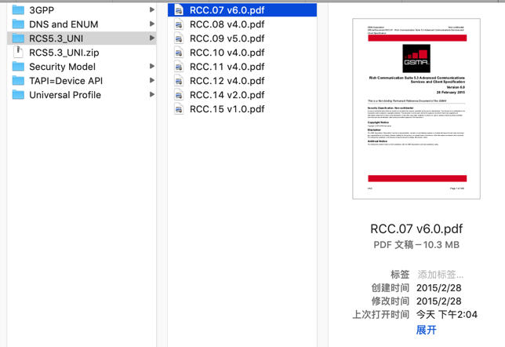

# RCS相关规范下载

* RCS 5.3
  * GSMA PRD RCC.07 - RCS 5.3 - Advanced Communications Services and Client Specification, Version 6.0, 28 Feb 2015
    * https://www.gsma.com/futurenetworks/wp-content/uploads/2015/03/RCS5.3_UNI.zip
      * 说明：成套的RCS的相关规范文件
        * 
* GSMA规范下载主入口
  * GSMA | Resources - Newsroom
    * https://www.gsma.com/newsroom/resources/
* 其他
  * http://www.gsma.com/network2020/wp-content/uploads/2015/06/RCC-55-v2-0.pdf
  * https://www.gsma.com/newsroom/wp-content/uploads//RCC.14_v5.0.pdf
  * https://www.gsma.com/newsroom/wp-content/uploads//RCC.07-v11.0-2.pdf
  * https://www.gsma.com/newsroom/wp-content/uploads//RCC.13-v5.0.pdf
  * https://www.gsma.com/newsroom/wp-content/uploads//RCC.15-v7.0.pdf
  * https://www.gsma.com/newsroom/wp-content/uploads//RCC.08-v9.0.pdf
  * https://www.gsma.com/newsroom/wp-content/uploads//RCC.14-v7.0-1.pdf
  * https://www.gsma.com/newsroom/wp-content/uploads//RCC.20-v6.0-3.pdf
  * https://www.gsma.com/newsroom/wp-content/uploads//RCC.20-v6.0-2.pdf
  * https://www.gsma.com/newsroom/wp-content/uploads//RCC.10-v9.0.pdf
  * https://www.gsma.com/newsroom/wp-content/uploads//RCC.11-v9.0.pdf
  * https://www.gsma.com/newsroom/wp-content/uploads//RCC.71-v2.4.pdf
  * https://www.gsma.com/newsroom/wp-content/uploads//RCC.07-v11.0-1.pdf
  * https://www.gsma.com/newsroom/wp-content/uploads//RCC.07-v11.0-2.pdf
  * https://www.gsma.com/newsroom/wp-content/uploads//RCC.15_v5.0.pdf
  * https://www.gsma.com/newsroom/wp-content/uploads//RCC.14_v5.0.pdf
  * https://www.gsma.com/newsroom/wp-content/uploads//RCC.15-v6.0.pdf
  * https://www.gsma.com/esim/wp-content/uploads/2013/02/RCC.13v1.0.pdf
  * http://www.gsma.com/esim/wp-content/uploads/2012/03/rcsapirequirementsv2_1.pdf
  * https://www.gsma.com/futurenetworks/wp-content/uploads/2012/03/rcs-e_advanced_comms_specification_v1_2_2_approved.pdf
  * https://www.gsma.com/futurenetworks/wp-content/uploads/2013/05/RCS-5.1-V2.0-UNI.pdf
  * https://www.gsma.com/futurenetworks/wp-content/uploads/2015/03/RCS5.3_UNI.zip
  * https://www.gsma.com/futurenetworks/wp-content/uploads/2017/07/RCC.71_v1.0.pdf
  * https://www.gsma.com/futurenetworks/wp-content/uploads/2017/07/RCC.71_v2.0.pdf
  * https://www.gsma.com/futurenetworks/wp-content/uploads/2019/09/rcsapirequirementsv2_1.pdf
  * https://www.gsma.com/futurenetworks/wp-content/uploads/2019/09/rcs5.0_endorsement_of_oma_sip_simple_im_version1.0.pdf
  * https://www.gsma.com/futurenetworks/wp-content/uploads/2019/09/RCC12_RCS5_1_endorsement_of_oma_sip_simple_im_v2.0.pdf
  * https://www.fftelecoms.org/app/uploads/2017/08/interface_specification_for_rcs_interconnection_dec_2016-2.pdf
  * https://www.gsma.com/futurenetworks/wp-content/uploads/2015/05/RCC-59-v1-0.pdf
  * https://www.gsma.com/newsroom/wp-content/uploads/IR.65-v30.0.pdf
  * https://www.etsi.org/deliver/etsi_es/282000_282099/282001/02.00.00_50/es_282001v020000m.pdf
  * 

