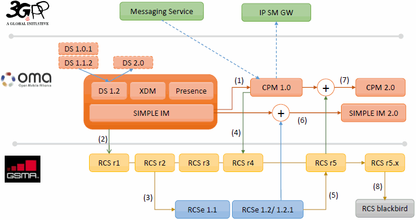
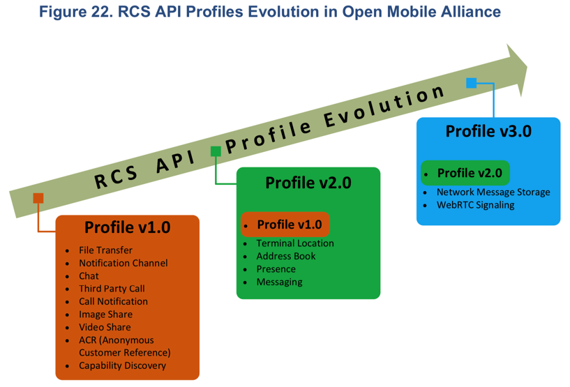
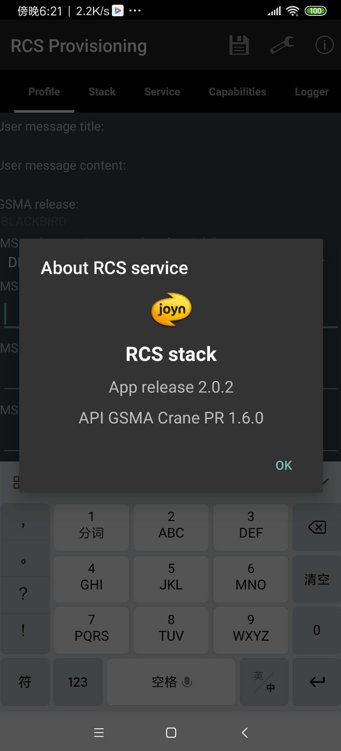
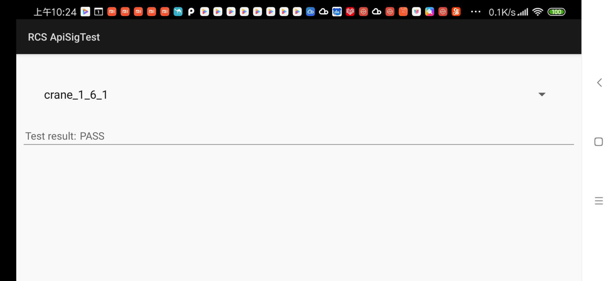
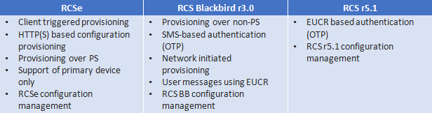
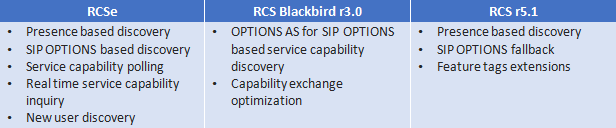

# RCS版本

关于RCS的总体版本演化，摘录之前在

[RCS版本历史 · 5G消息RCS技术总结](https://book.crifan.com/books/5g_message_rcs_tech_summary/website/rcs_intro/version_history.html)

已整理的

## RCS协议版本演化

* Evolution of GSMA RCS standards
  * 

## RCS的API的版本

`RCS`的`API`是`OMA`组织定义的

* OMA定义的RCS的API的版本历史
  * 图
    * RCS API Profiles Evolution in Open Mobile Alliance
      * 
  * 文字版
    * Profile v3.0
      * Network Message Storage
      * WebRTC Signaling
      * Profile v2.0
        * Terminal Location
        * Address Book
        * Presence
        * Messaging
        * Profile v1.0
          * File Transfer
          * Notification Channel
          * Chat
          * Third Party Call
          * Call Notification
          * Image Share
          * Video Share
          * ACR (Anonymous Customer Reference)
          * Capability Discovery

## RCS的名词关系：Albatros、Blackbird、Crane、joyn

目前理解：

* RCS版本=API 版本
  * Albatros
    * =RCS 5.1
  * Blackbird
    * = RCS 5.2
  * Crane
    * = API 1.6.0 / 1.6.1
      * RCS的core的apk -> About中看到 `API GSMA Crane PR 1.6.0`
        * 
      * ApiSigTest = API签名测试 中是：`crane_1_6_1`
        * 

根据 [rcsjta/Branches.md at wiki · android-rcs/rcsjta](https://github.com/android-rcs/rcsjta/blob/wiki/Branches.md) 最新理解：

* RCS分2部分
  * RCS 的core 或stack：RCS stack的版本
  * TAPI=Terminal API：终端设备API接口 的版本
* 目前已发布的版本
  * 主分支
    * master
      * RCS Crane  = RCS Crane PR (Priority Release)：RCS 5.3
      * TAPI 1.6.1
    * tapi_1.6.1
      * RCS Blackbird：RCS 5.30
      * TAPI 1.6.1
    * tapi_1.5.1
      * RCS Blackbird：RCS 5.0 和 5.1  +  RCS-e 1.2.2
      * TAPI 1.5.1
    * Albatros
      * RCS Albatros 2.0
      * Albatros TAPI
  * 临时分支
    * securitymodel3
      * RCS Blackbird：RCS 5.0 和 5.1  +  RCS-e 1.2.2
      * TAPI 1.5
      * 安全模型
    * cpm
    * tapi_0.9.0

---

* RCS相关概念
  * 协议版本
    * Albatros=RCS 5.1
    * Blackbird= RCS 5.2
      * RCS Blackbird
        * 目的：在 RCSe - RCS r5.1 之间的过渡
          * 功能对比
            * 图
              * 
            * 文字
              * RCSe
                * 关注重点：简单的IP聊天
              * RCS r5.1
                * 关注重点：聚合IP通讯服务
                  * converged IP communication service
        * 发展经历了
          * RCS 3.0
          * RCS 4.0
        * 包含功能
          * 基于IP的聊天功能
          * 基于HTTP的文件传输
          * 兼容旧消息
          * 支持多设备
          * 基于SIP OPTIONS的服务发现
          * 增强的Provisioning功能
          * 内容分享
          * 基于WiFi的语音电话
        * joyn Blackbird支持情况
          * 已认证
            * Samsung
            * LG
            * Nokia
            * Microsoft
            * Sony
            * HTC
            * Jibe Mobile
            * Huawei
            * TCL
          * 支持的设备
            * 运营商？
              * Germany的Deutsche Telekom
              * Vodafone Germany的多个设备
                * HTC One M7
                * M8 Mini
                * LG70
                * Samsung S4
                * Samsung S4 Mini
                * Samsung S5
                * Sony Xperia Z1
    * Crane
      * 基于
        * RCS 5.3
        * RCC.61 Common Core feature set
      * 是Blackbird的升级版
      * API
        * TAPI 1.6.0
        * TAPI 1.6.1
      * 主要更新
        * Common Message Store- for the backup and restoration of messages and an enabler for a multi-device experience.
        * Voice and Video calling over Wi-Fi
        * Green Button Promise for voice and video
        * Audio Messaging
        * Security against malware
  * RCS extensions
    * Applications adding functionality to native devices utilising RCS APIs
  * RCS领域内的Provisioning
    * Provisioning
      * 直译：
        * n. 准备金提取
        * v. 供应补给品（provision的ing形式）
            * provision
                * 直译：
                    * n. 规定；条款；准备；[经] 供应品
                    * vt. 供给…食物及必需品
    * 可以理解为：服务service（的供给）
      * -》提供（RCS）服务
      * 最新：正确翻译应该是：
        * `Provisioning`=`开通`=`开通服务`
          * 开通RCS服务，需要各种条件
            * 需要进行各种参数配置，才能开通RCS服务
    * Configuration Provisioning
      * 是一个过程
        * 获取配置
            * 用于让支持了RCS的设备，发现和知道相关服务提供方的对应的配置信息
      * 目的
        * RCS设备，获取了配置参数（configuration parameters）后，才方便访问IMS core和RCS的服务
      * 何时、次数
        * 在用户注册到IMS core之前，有且要做1次Configuration Provisioning
      * 配置参数configuration parameters
        * 包含
          * 各种MO=Management Objects
      * 设备接入（用于访问configuration server）对比
        * RCSe：只支持PS（数据包交换 ）网络 方式
        * RCS Blackbird：支持多种设备
          * 接入设备类型
            * 带SIM卡的
            * 不带SIM卡的
          * 举例
            * 用户的主设备，通过WiFi接入
            * 用户的不带（或忽略是否有）SIM卡的从设备
      * 设备接入方式=Provisioning方式
        * PS网络
          * 配置服务器 认证设备（是否有效）有多种方式
            * 基于IMS的认证
            * 基于用户IP地址的认证
        * WiFi网络
          * 特殊性：无法通过上述的IMS或IP地址认证
            * 因为设备往往是私有IP地址
              * 进一步：从设备无法获取（主设备的）IMSI
          * 认证方式
            * OTP认证
              * 逻辑：配置服务器生成OTP，通过SMS，发送给主设备
              * 注：
                * RCS 5.1中，也可通过EUCR去申请获取OTP
                  * 通过IMS网络返回的XML的SIP消息的body中包含OTP
      * 更新Provisioning配置
        * 背景：configuration server也可以触发让RCS客户端进行配置初始化
          * 实现方式
            * SMS
            * EUCR
        * 常见场景
          * 服务配置更改后
          * RCS客户端版本升级后
          * 用户设备中（重新）激活被禁用的RCS客户端
  * Service Capability Discovery=服务能力发现
    * 是什么：一个过程
      * 寻找发现一个地址本里的联系人，是否具有对应能力
        * 以此去确定其是否是一个RCS的用户
    * 实现方式
      * 根据技术不同和使用场景可分2种
        * 基于Presence
        * 基于SIP OPTIONS
    * 不同协议对比
      * 
  * RCS UP
    * 支持功能
      * capability discovery能力发现
        * 实现不同区域间互操作
      * chat聊天
      * group chat群聊
      * file transfer文件传输
      * audio messaging语音消息
      * video share视频分享
      * multi-device多设备支持
      * enriched calling增强电话
      * location share位置分享
      * live sketching=Live Sketch Sharing
        * Sketch=素描？ = 涂鸦？
    * 核心
      * MaaP=Messaging as a Platform
        * 支持
          * RCS business messaging=RCS商业消息
          * Rich Cards=富媒体卡片
          * privacy control=隐私控制
          * spam protection=垃圾过滤防护
  * MaaP和Chatbot
    * RCS UP 2.0协议支持Chatbot平台
      * 不同厂家会实现自己的API
        * 举例
          * 三星的MaaP API
            * [GSMA MaaP API (1.8.*)](https://rcs.developer.samsung.com/develop/Development/Any%20language%20chatbot%20development/API%20reference/platform-chatbot-api-reference.html)
    * 相关协议是
      * RCS UP 2.0
        * Section 15 and Annex A
          * 针对：Chatbot product manager and designer
      * RCS 7.0
        *  Section 3.6.10
          * 针对Chatbot developer
  * 相关理解
    * RCS重点在于：Advanced Communications （更）高级的通讯
      * 和谁对比：
        * 传统的 普通的通讯
          * 早期：基于文本的SMS消息
          * 后来的：多媒体消息MMS
      * 高级在于支持更多功能
        * 如前所述的 群聊，视频分享，位置分享等等
          * 早期通讯方式所不支持（也无法支持）的功能
