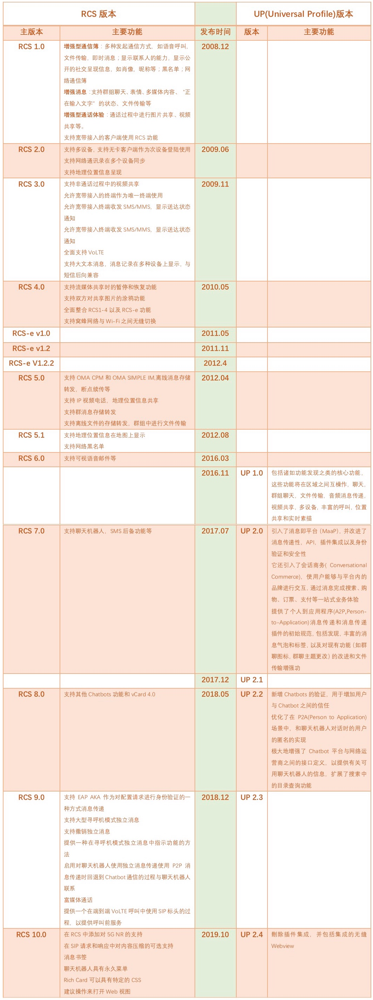

# RCS版本

关于RCS的总体版本演化，摘录之前在

[RCS版本历史 · 5G消息RCS技术总结](https://book.crifan.com/books/5g_message_rcs_tech_summary/website/rcs_intro/version_history.html)

已整理的

## RCS协议版本演化

* Evolution of GSMA RCS standards
  * 

## RCS的API的版本

`RCS`的`API`是`OMA`组织定义的

* OMA定义的RCS的API的版本历史
  * 图
    * RCS API Profiles Evolution in Open Mobile Alliance
      * 
  * 文字版
    * Profile v3.0
      * Network Message Storage
      * WebRTC Signaling
      * Profile v2.0
        * Terminal Location
        * Address Book
        * Presence
        * Messaging
        * Profile v1.0
          * File Transfer
          * Notification Channel
          * Chat
          * Third Party Call
          * Call Notification
          * Image Share
          * Video Share
          * ACR (Anonymous Customer Reference)
          * Capability Discovery
