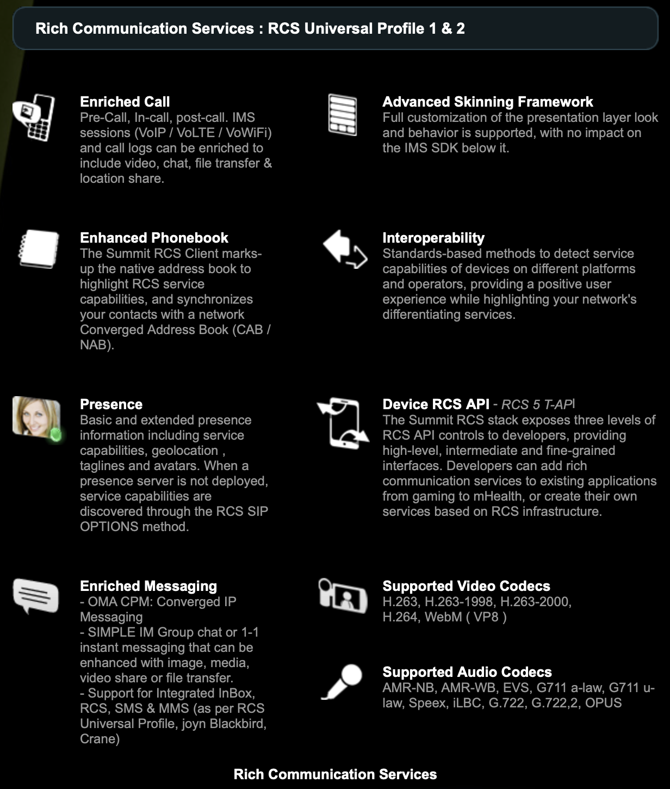

# RCS UP

* `RCS UP`
  * =`RCS Universal Profile`
  * 核心功能
    * 概览
      * 
    * 详解
      * Enriched Call
        * Pre-Call, In-call, post-call. IMS sessions (VoIP / VoLTE / VoWiFi) and call logs can be enriched to include video, chat, file transfer & location share.
      * Enhanced Phonebook
        * The Summit RCS Client marks-up the native address book to highlight RCS service capabilities, and synchronizes your contacts with a network Converged Address Book (CAB / NAB).
      * Enriched Messaging
        * OMA CPM: Converged IP Messaging
        * SIMPLE IM Group chat or 1-1 instant messaging that can be enhanced with image, media, video share or file transfer.
        * Support for Integrated InBox, RCS, SMS & MMS (as per RCS Universal Profile, joyn Blackbird, Crane)
      * Presence
        * Basic and extended presence information including service capabilities, geolocation , taglines and avatars. When a presence server is not deployed, service capabilities are discovered through the RCS SIP OPTIONS method.
      * Advanced Skinning Framework
        * Full customization of the presentation layer look and behavior is supported, with no impact on the IMS SDK below it.
      * Interoperability
        * Standards-based methods to detect service capabilities of devices on different platforms and operators, providing a positive user experience while highlighting your network's differentiating services.
      * Device RCS API
        * = RCS 5 T-API
        * The Summit RCS stack exposes three levels of RCS API controls to developers, providing high-level, intermediate and fine-grained interfaces. Developers can add rich communication services to existing applications from gaming to mHealth, or create their own services based on RCS infrastructure.
      * Supported Video Codecs
        * H.263, H.263-1998, H.263-2000, H.264, WebM ( VP8 )
      * Supported Audio Codecs
        * AMR-NB, AMR-WB, EVS, G711 a-law, G711 u-law, Speex, iLBC, G.722, G.722,2, OPUS
