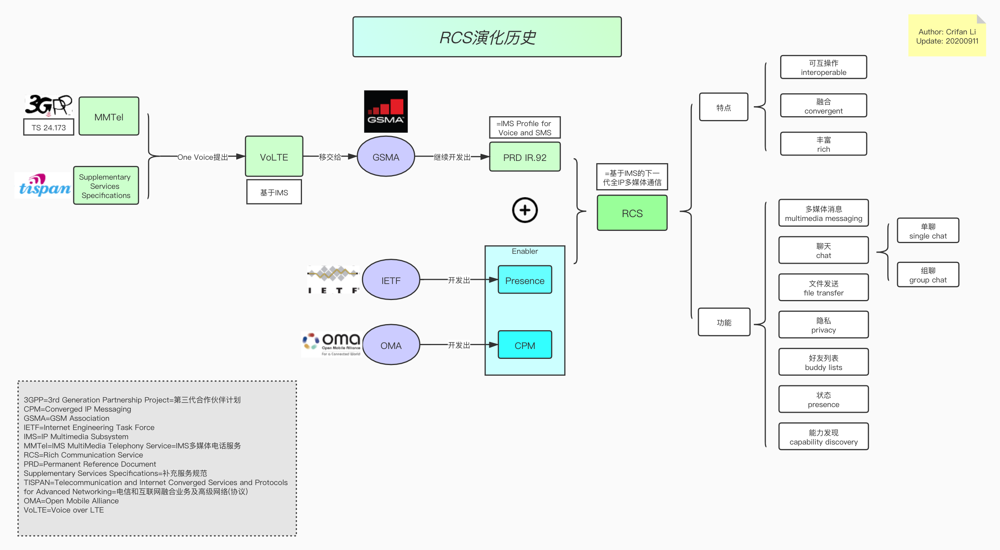

# RCS演化历史

此处从技术角度来解释，`RCS`的演化历史，如何诞生的，以及核心特点：

* RCS演化历史
  * 图
    * 本地
      * 
    * 在线浏览
      * RCS演化历史 在线浏览
        * https://www.processon.com/view/link/5f5ad62b07912902cf81b60a
  * 文字版
    * 简述
      * 3GPP的MMTel
      * ->（One Voice提出）VoLTE
      * -> 移交给GSMA，独立出RCS项目
      * `+` 辅助协议：IETF和OMA的Presence和CPM
      * =完整的RCS
        * 概述：基于IMS的全IP多媒体通信
        * 特点：
          * 可互操作
          * 融合
          * 丰富
        * 功能
          * 多媒体消息multimedia messaging
          * 聊天chat
            * single chat 单聊
            * group chat 群聊=组聊
          * 文件发送file transfer
          * 隐私privacy
          * 好友列表buddy lists
          * 状态 presence
          * 能力发现capability discovery
    * 详解
        * 最早在部署LTE期间产生了需求：基于IMS的电话服务，即VoLTE
        * 通过考虑到3GPP第7版中定义的TS 24.173中规定的 MMTel=IMS MultiMedia Telephony Service=IMS多媒体电话服务 标准，One Voice行业计划构想了基于LTE的基于IMS的电话服务的简单配置文件
        * One Voice还考虑了由ETSI TISPAN开发的补充服务规范Supplementary Services Specifications，该规范已转移到3GPP
        * One Voice规范已提交给GSM协会（GSMA），作为基于IMS的VoLTE解决方案进行进一步增强。 基于一种语音规范，GSMA开发了永久参考文档（PRD）IR.92。 IR.92也称为语音和SMS的IMS配置文件，它指定了3GPP第8版中定义的最低强制性功能集，无线设备和网络将VoLTE实施为可互操作的，高质量的，基于IMS的电话通过LTE服务。 虽然VoLTE适合替代现有的CS语音，但是GSMA PRD IR.92还介绍了支持CS-IMS语音转换的功能。
        * 在此期间，IETF=Internet Engineering Task Force=互联网工程任务组 和 OMA=Open Mobile Alliance=开放移动联盟 等标准机构正在开发使能技术，例如Presence=状态，CPM=Converged IP Messaging=融合IP消息系统 和其他支持使能器，用作下一代消息框架。 很明显，有必要发展现有的基于xMS的消息传递服务，以提供更丰富的用户体验，并允许基于它的新服务的开发。
        * RCS最初是由多家主要运营商和OEM，于2007年发起的一项行业倡议。他们希望探索下一代全IP多媒体通信，从而能够快速采用移动应用程序和服务，并基于IMS架构，提供可互操作，融合和丰富的通信体验。 当由于业界的极大兴趣而使这一计划变得太大时，把计划转向了GSMA，以利用其组织支持和项目管理技能使之成为真正的全球项目。 在GSMA中，Network 2020计划=Network 2020 Program 下的 全球规范小组=Global Specification Group 负责开发和维护相关的RCS规范
