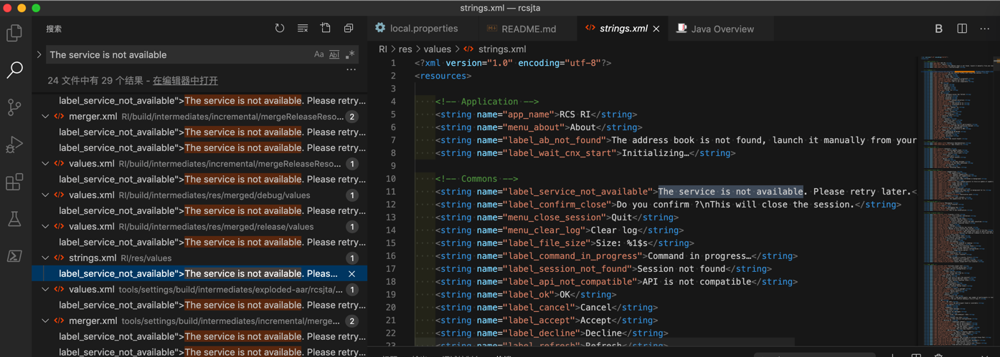
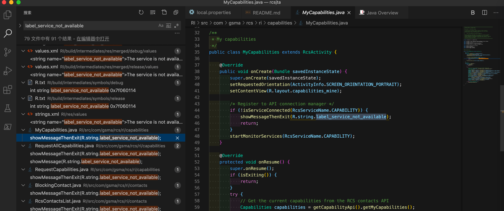
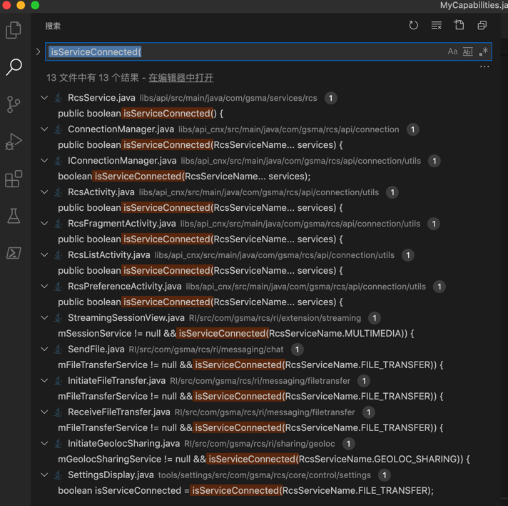
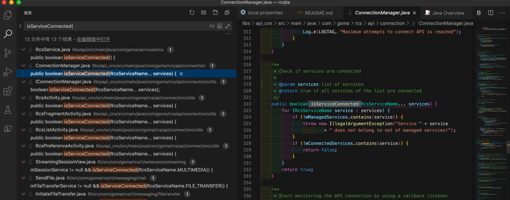
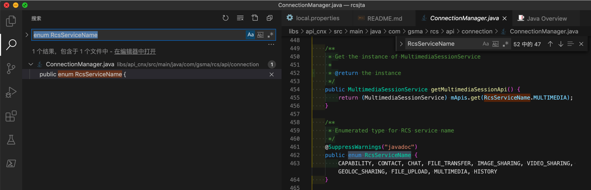

# rcsjta源码分析

折腾rcsjta开发期间，尤其是尝试分析RCS服务为何没有启动`The service is not available`期间，研究了相关代码的逻辑，整理如下供参考。

## The service is not available 相关代码逻辑

搜：

The service is not available

找到很多个。

其中RI中的是：

`rcsjta/RI/res/values/strings.xml`

```xml
    <string name="label_service_not_available">The service is not available. Please retry later.</string>
```



去找找代码中哪里用到了：`label_service_not_available`

看到了 Capability的对应代码

`rcsjta/RI/src/com/gsma/rcs/ri/capabilities/MyCapabilities.java`

```java
public class MyCapabilities extends RcsActivity {

    @Override
    public void onCreate(Bundle savedInstanceState) {
        super.onCreate(savedInstanceState);
        setRequestedOrientation(ActivityInfo.SCREEN_ORIENTATION_PORTRAIT);
        setContentView(R.layout.capabilities_mine);

        /* Register to API connection manager */
        if (!isServiceConnected(RcsServiceName.CAPABILITY)) {
            showMessageThenExit(R.string.label_service_not_available);
            return;
        }
        startMonitorServices(RcsServiceName.CAPABILITY);
    }
```



继续去研究代码

搜

`isServiceConnected(`

找到多处定义



找到了

`rcsjta/libs/api_cnx/src/main/java/com/gsma/rcs/api/connection/ConnectionManager.java`

```java
    /**
     * Check if services are connected
     *
     * @param services list of services
     * @return true if all services of the list are connected
     */
    public boolean isServiceConnected(RcsServiceName... services) {
        for (RcsServiceName service : services) {
            if (!mManagedServices.contains(service)) {
                throw new IllegalArgumentException("Service " + service
                        + " does not belong to set of managed services!");
            }
            if (!mConnectedServices.contains(service)) {
                return false;
            }
        }
        return true;
    }
```



其他地方都是调用这个`ConnectionManager.java`中的`isServiceConnected`

且其中的：`mManagedServices` 是开始初始化包含的一个列表：

```java
    /**
     * The set of managed services
     */
    private final Set<RcsServiceName> mManagedServices;

    /**
     * Constructor
     *
     * @param context The context
     * @param managedServices Set of managed services
     * @param rcsServiceControl instance of RcsServiceControl
     */
    private ConnectionManager(Context context, Set<RcsServiceName> managedServices,
            RcsServiceControl rcsServiceControl) {
        mCtx = context;
        mCnxIntent = PendingIntent.getBroadcast(context, 0, new Intent(ACTION_CONNECT), 0);
        mAlarmManager = (AlarmManager) mCtx.getSystemService(Context.ALARM_SERVICE);

        mManagedServices = managedServices;
        mRcsServiceControl = rcsServiceControl;
        /* Construct list of connected services */
        mConnectedServices = new HashSet<>();
        /* Construct list of clients to notify */
        mClientsToNotify = new HashMap<>();
        /* Construct list of APIs */
        mApis = new HashMap<>();

        if (managedServices == null || managedServices.isEmpty()) {
            throw new RuntimeException("Incorrect parameter managedService!");
        }
        /* Instantiate APIs */
        for (RcsServiceName service : mManagedServices) {
            switch (service) {
                case CAPABILITY:
                    mApis.put(RcsServiceName.CAPABILITY, new CapabilityService(context,
                            newRcsServiceListener(RcsServiceName.CAPABILITY)));
                    break;
                case CHAT:
                    mApis.put(RcsServiceName.CHAT, new ChatService(context,
                            newRcsServiceListener(RcsServiceName.CHAT)));
                    break;
                case CONTACT:
                    mApis.put(RcsServiceName.CONTACT, new ContactService(context,
                            newRcsServiceListener(RcsServiceName.CONTACT)));
                    break;
                case FILE_TRANSFER:
                    mApis.put(RcsServiceName.FILE_TRANSFER, new FileTransferService(context,
                            newRcsServiceListener(RcsServiceName.FILE_TRANSFER)));
                    break;
                case FILE_UPLOAD:
                    mApis.put(RcsServiceName.FILE_UPLOAD, new FileUploadService(context,
                            newRcsServiceListener(RcsServiceName.FILE_UPLOAD)));
                    break;
                case GEOLOC_SHARING:
                    mApis.put(RcsServiceName.GEOLOC_SHARING, new GeolocSharingService(context,
                            newRcsServiceListener(RcsServiceName.GEOLOC_SHARING)));
                    break;
                case HISTORY:
                    mApis.put(RcsServiceName.HISTORY, new HistoryService(context,
                            newRcsServiceListener(RcsServiceName.HISTORY)));
                    break;
                case IMAGE_SHARING:
                    mApis.put(RcsServiceName.IMAGE_SHARING, new ImageSharingService(context,
                            newRcsServiceListener(RcsServiceName.IMAGE_SHARING)));
                    break;
                case MULTIMEDIA:
                    mApis.put(RcsServiceName.MULTIMEDIA, new MultimediaSessionService(context,
                            newRcsServiceListener(RcsServiceName.MULTIMEDIA)));
                    break;
                case VIDEO_SHARING:
                    mApis.put(RcsServiceName.VIDEO_SHARING, new VideoSharingService(context,
                            newRcsServiceListener(RcsServiceName.VIDEO_SHARING)));
                    break;
            }
        }
    }
```

其中容易看出是各个功能和服务项目：

* CAPABILITY
* CHAT
* CONTACT
* FILE_TRANSFER
* FILE_UPLOAD
* GEOLOC_SHARING
* HISTORY
* IMAGE_SHARING
* MULTIMEDIA
* VIDEO_SHARING

再去看看`mConnectedServices`

```java
    /**
     * Set of connected services
     */
    private final Set<RcsServiceName> mConnectedServices;

        mConnectedServices = new HashSet<>();

    /**
     * Create a RCS service listener to monitor API connection
     *
     * @param service the service to monitor
     * @return the listener
     */
    private RcsServiceListener newRcsServiceListener(final RcsServiceName service) {
        return new RcsServiceListener() {
            @Override
            public void onServiceConnected() {
                mConnectedServices.add(service);
                notifyConnection(service);
            }

            @Override
            public void onServiceDisconnected(ReasonCode error) {
                mConnectedServices.remove(service);
                notifyDisconnection(service, error);
            }
        };

    }

        public void notifyConnection() {
            if (mListener == null) {
                return;
            }
            if (mConnectedServices.containsAll(mMonitoredServices)) {
                /* All monitored services are connected -> notify connection */
                mListener.onServiceConnected();
                mRetryCount = 0;
            }
        }
```

其中的：`newRcsServiceListener`，就是前面调用的。

不过注意到开始的`ConnectionManager()`初始化期间，是根据传入的`mManagedServices`去初始化对应服务的。所以要再去找找有哪些地方用到了：

`ConnectionManager(`

发现只有自己

`libs/api_cnx/src/main/java/com/gsma/rcs/api/connection/ConnectionManager.java`

```java
    /**
     * Get an instance of ConnectionManager.
     *
     * @param ctx the context
     * @param rcsServiceControl instance of RcsServiceControl
     * @param managedServices Set of managed services
     * @return the singleton instance.
     */
    public static ConnectionManager createInstance(Context ctx,
            RcsServiceControl rcsServiceControl, Set<RcsServiceName> managedServices) {
        if (sInstance != null) {
            return sInstance;
        }
        synchronized (ConnectionManager.class) {
            if (sInstance == null) {
                if (ctx == null) {
                    throw new IllegalArgumentException("Context is null");
                }
                sInstance = new ConnectionManager(ctx, managedServices, rcsServiceControl);
            }
        }
        return sInstance;
    }
```

继续研究原因。

继续找：

`createInstance(`

找到：

`libs/api_cnx/src/main/java/com/gsma/rcs/api/connection/ConnectionManager.java`

```java
    /**
     * Get an instance of ConnectionManager.
     *
     * @param context the context
     * @param rcsServiceControl instance of RcsServiceControl
     * @param services list of managed services
     * @return the singleton instance.
     */
    public static ConnectionManager createInstance(Context context,
            RcsServiceControl rcsServiceControl, RcsServiceName... services) {
        Set<RcsServiceName> managedServices = new HashSet<>();
        Collections.addAll(managedServices, services);
        return createInstance(context, rcsServiceControl, managedServices);
    }
```

以及真正的调用去初始化：

`RI/src/com/gsma/rcs/ri/RiApplication.java`

```java
    @Override
    public void onCreate() {
        super.onCreate();
...

        mRcsServiceControl = RcsServiceControl.getInstance(mContext);

        /* Starts the RCS service notification manager */
        startService(new Intent(this, RcsServiceNotifManager.class));

        /* Do not execute the ConnectionManager on the main thread */
        Handler mainThreadHandler = new Handler(Looper.getMainLooper());
        final ConnectionManager cnxManager = ConnectionManager.createInstance(mContext,
                mRcsServiceControl, EnumSet.allOf(RcsServiceName.class));
        mainThreadHandler.postDelayed(new Runnable() {
            @Override
            public void run() {
                try {
                    cnxManager.start();
                    sCnxManagerStarted = true;

                } catch (RuntimeException e) {
                    Log.e(LOGTAG, "Failed to start connection manager!", e);
                }
            }
        }, DELAY_FOR_STARTING_CNX_MANAGER);
    }
```

和：

`tools/settings/src/com/gsma/rcs/core/control/CoreControlApplication.java`

```java
public class CoreControlApplication extends Application {

    @Override
    public void onCreate() {
        super.onCreate();
        Context context = getApplicationContext();
        mRcsServiceControl = RcsServiceControl.getInstance(context);

        final ConnectionManager cnxManager = ConnectionManager.createInstance(context,
                mRcsServiceControl, RcsServiceName.FILE_TRANSFER, RcsServiceName.CHAT,
                RcsServiceName.CONTACT);

        /* Do not execute the ConnectionManager on the main thread */
        Handler mainThreadHandler = new Handler(Looper.getMainLooper());

        mainThreadHandler.postDelayed(new Runnable() {
            @Override
            public void run() {
                cnxManager.start();
                sCnxManagerStarted = true;
            }
        }, DELAY_FOR_STARTING_CNX_MANAGER);
    }
```

此处很明显`Core`的`control`的`application`中，最开始启动时，只初始化了：

* FILE_TRANSFER
* CHAT
* CONTACT

并没有初始化其他的服务，比如Capability之类的，不知道为何？

去搜索其他的`RcsServiceName.CAPABILITY`，能找到其他的，但是没有找到启用的相关逻辑

所以难怪app中没看到服务启动

那如何启动其他如Capability的服务?

直接修改代码去加上？

感觉好像不太对啊，应该是哪里有配置，最开始启动哪些服务才对

去`Core`的`app`中看看

不过才注意到：

`RI/src/com/gsma/rcs/ri/RiApplication.java`

中的：

```java
final ConnectionManager cnxManager = ConnectionManager.createInstance(mContext,
                mRcsServiceControl, EnumSet.allOf(RcsServiceName.class));
```

就是启动了RcsServiceName的所有的类名

就是启动了所有的服务才对

即RI的参考实现中，最开始是去启动了所有的服务的

对于`RcsServiceName`的定义，找了半天终于通过搜：

`package com.gsma.rcs.api`

间接的，最后找到了位置，是在api_cnx中的：

`libs/api_cnx/src/main/java/com/gsma/rcs/api/connection/ConnectionManager.java`

而以为能找到原始定义：

```java
        /* Instantiate APIs */
        for (RcsServiceName service : mManagedServices) {
            switch (service) {
                case CAPABILITY:
                    mApis.put(RcsServiceName.CAPABILITY, new CapabilityService(context,
                            newRcsServiceListener(RcsServiceName.CAPABILITY)));
                    break;
                case CHAT:
                    mApis.put(RcsServiceName.CHAT, new ChatService(context,
                            newRcsServiceListener(RcsServiceName.CHAT)));
                    break;
                case CONTACT:
                    mApis.put(RcsServiceName.CONTACT, new ContactService(context,
                            newRcsServiceListener(RcsServiceName.CONTACT)));
                    break;
                case FILE_TRANSFER:
                    mApis.put(RcsServiceName.FILE_TRANSFER, new FileTransferService(context,
                            newRcsServiceListener(RcsServiceName.FILE_TRANSFER)));
                    break;
                case FILE_UPLOAD:
                    mApis.put(RcsServiceName.FILE_UPLOAD, new FileUploadService(context,
                            newRcsServiceListener(RcsServiceName.FILE_UPLOAD)));
                    break;
                case GEOLOC_SHARING:
                    mApis.put(RcsServiceName.GEOLOC_SHARING, new GeolocSharingService(context,
                            newRcsServiceListener(RcsServiceName.GEOLOC_SHARING)));
                    break;
                case HISTORY:
                    mApis.put(RcsServiceName.HISTORY, new HistoryService(context,
                            newRcsServiceListener(RcsServiceName.HISTORY)));
                    break;
                case IMAGE_SHARING:
                    mApis.put(RcsServiceName.IMAGE_SHARING, new ImageSharingService(context,
                            newRcsServiceListener(RcsServiceName.IMAGE_SHARING)));
                    break;
                case MULTIMEDIA:
                    mApis.put(RcsServiceName.MULTIMEDIA, new MultimediaSessionService(context,
                            newRcsServiceListener(RcsServiceName.MULTIMEDIA)));
                    break;
                case VIDEO_SHARING:
                    mApis.put(RcsServiceName.VIDEO_SHARING, new VideoSharingService(context,
                            newRcsServiceListener(RcsServiceName.VIDEO_SHARING)));
                    break;
            }
```

还是没有直接定义。


然后去找最原始的定义。通过`VIDEO_SHARING`找到：

`core/src/com/gsma/rcs/provider/sharing/VideoSharingProvider.java`

```java
    private static final class UriType {

        private static final class VideoSharing {
            private static final int VIDEO_SHARING = 1;

            private static final int VIDEO_SHARING_WITH_ID = 2;
        }

        private static final class InternalVideoSharing {
            private static final int VIDEO_SHARING = 3;

            private static final int VIDEO_SHARING_WITH_ID = 4;
        }
    }
```

看来是不同的类和实现中有最原始的定义，且是`int`值

不过后来终于找到了定义：

`libs/api_cnx/src/main/java/com/gsma/rcs/api/connection/ConnectionManager.java`

```java
    /**
     * Enumerated type for RCS service name
     */
    @SuppressWarnings("javadoc")
    public enum RcsServiceName {
        CAPABILITY, CONTACT, CHAT, FILE_TRANSFER, IMAGE_SHARING, VIDEO_SHARING, GEOLOC_SHARING, FILE_UPLOAD, MULTIMEDIA, HISTORY
    }
```
即：该文件中是有定义的。

不是在每个具体实现中定义的。前面理解有误。

反推再去搜：

`enum RcsServiceName`

只能找到此处这一处：



也是对的。

至此基本上确定，代码逻辑上来说，应该就是：

`RI/src/com/gsma/rcs/ri/RiApplication.java`

```java
        /* Do not execute the ConnectionManager on the main thread */
        Handler mainThreadHandler = new Handler(Looper.getMainLooper());
        final ConnectionManager cnxManager = ConnectionManager.createInstance(mContext,
                mRcsServiceControl, EnumSet.allOf(RcsServiceName.class));
        mainThreadHandler.postDelayed(new Runnable() {
            @Override
            public void run() {
                try {
                    cnxManager.start();
                    sCnxManagerStarted = true;

                } catch (RuntimeException e) {
                    Log.e(LOGTAG, "Failed to start connection manager!", e);
                }
            }
        }, DELAY_FOR_STARTING_CNX_MANAGER);
    }
```

这句：

```java
final ConnectionManager cnxManager = ConnectionManager.createInstance(mContext,
                mRcsServiceControl, EnumSet.allOf(RcsServiceName.class));
```

去启动了RCS所有的服务。

至于后续为何服务还是没启动，则需要后续深入调研其他方面，才可能找到原因。
