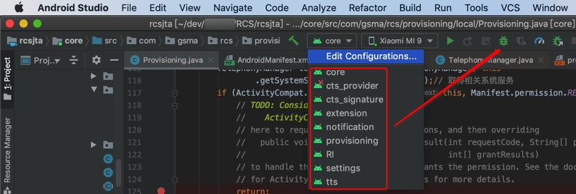

# 编译apk

然后去编译rcsjta的项目，生成apk，调试安装到安卓手机中。

## 编译apk

有2种方式：

* `gradlew`命令行
* Android Studio中图形界面中点击调试
  * 即可编译和生成apk，并安装到已连接的安卓手机中
    * 

### gradlew命令行

#### 查看有哪些任务

```bash
gradlew tasks
```

输出：

```bash
------------------------------------------------------------
All tasks runnable from root project
------------------------------------------------------------


Android tasks
-------------
androidDependencies - Displays the Android dependencies of the project.
signingReport - Displays the signing info for each variant.
sourceSets - Prints out all the source sets defined in this project.


Build tasks
-----------
assemble - Assembles all variants of all applications and secondary packages.
assembleAndroidTest - Assembles all the Test applications.
assembleDebug - Assembles all Debug builds.
assembleRelease - Assembles all Release builds.
build - Assembles and tests this project.
buildDependents - Assembles and tests this project and all projects that depend on it.
buildNeeded - Assembles and tests this project and all projects it depends on.
clean - Deletes the build directory.
compileDebugAndroidTestSources
compileDebugSources
compileDebugUnitTestSources
compileReleaseSources
compileReleaseUnitTestSources
extractDebugAnnotations - Extracts Android annotations for the debug variant into the archive file
extractReleaseAnnotations - Extracts Android annotations for the release variant into the archive file
mockableAndroidJar - Creates a version of android.jar that's suitable for unit tests.


Build Setup tasks
-----------------
init - Initializes a new Gradle build. [incubating]
wrapper - Generates Gradle wrapper files. [incubating]


Help tasks
----------
buildEnvironment - Displays all buildscript dependencies declared in root project 'rcsjta'.
components - Displays the components produced by root project 'rcsjta'. [incubating]
dependencies - Displays all dependencies declared in root project 'rcsjta'.
dependencyInsight - Displays the insight into a specific dependency in root project 'rcsjta'.
help - Displays a help message.
model - Displays the configuration model of root project 'rcsjta'. [incubating]
projects - Displays the sub-projects of root project 'rcsjta'.
properties - Displays the properties of root project 'rcsjta'.
tasks - Displays the tasks runnable from root project 'rcsjta' (some of the displayed tasks may belong to subprojects).


Install tasks
-------------
installDebug - Installs the Debug build.
installDebugAndroidTest - Installs the android (on device) tests for the Debug build.
uninstallAll - Uninstall all applications.
uninstallDebug - Uninstalls the Debug build.
uninstallDebugAndroidTest - Uninstalls the android (on device) tests for the Debug build.
uninstallRelease - Uninstalls the Release build.


Verification tasks
------------------
check - Runs all checks.
connectedAndroidTest - Installs and runs instrumentation tests for all flavors on connected devices.
connectedCheck - Runs all device checks on currently connected devices.
connectedDebugAndroidTest - Installs and runs the tests for debug on connected devices.
deviceAndroidTest - Installs and runs instrumentation tests using all Device Providers.
deviceCheck - Runs all device checks using Device Providers and Test Servers.
lint - Runs lint on all variants.
lintDebug - Runs lint on the Debug build.
lintRelease - Runs lint on the Release build.
test - Run unit tests for all variants.
testDebugUnitTest - Run unit tests for the debug build.
testReleaseUnitTest - Run unit tests for the release build.


Other tasks
-----------
assembleDefault
extractProguardFiles
jarDebugClasses
jarReleaseClasses
javadoc
transformResourcesWithMergeJavaResForDebugUnitTest
transformResourcesWithMergeJavaResForReleaseUnitTest
```


#### 查看子项目

```bash
gradlew projects
```

输出：

* Root project rcsjta
  * RI
  * api
  * api_cnx
  * bouncycastle
  * core
  * cts_provider
  * cts_signature
  * extension
  * mediaplayer
  * nist_sip
  * notification
  * provisioning
  * settings
  * tts

#### 用命令行编译RCS的apk

* core
  * 编译：`gradlew :core:build`
  * 清理：`gradlew :core:clean`
  * 输出
    * rcsjta/core/build/outputs/apk
      * `RCS_Core-debug.apk`
        * 用于调试期间，安装到安卓手机中
      * `RCS_Core-release-unsigned.apk`
  * 说明
    * 编译core期间还会编译所依赖的其他子项目
      * api
      * bouncycastle
      * nist_sip
* RI
  * =`Reference Implement`=参考实现
  * 编译：`gradlew :RI:build`
  * 清理：`gradlew :RI:clean`
  * 输出
    * rcsjta/RI/build/outputs/apk
      * `RI-debug.apk`
      * `RI-release-unsigned.apk`
* settings
  * 编译：`gradlew :settings:build`
  * 清理：`gradlew :settings:clean`
  * 输出
    * rcsjta/settings/build/outputs/apk
      * `settings-debug.apk`
      * `settings-release-unsigned.apk`
