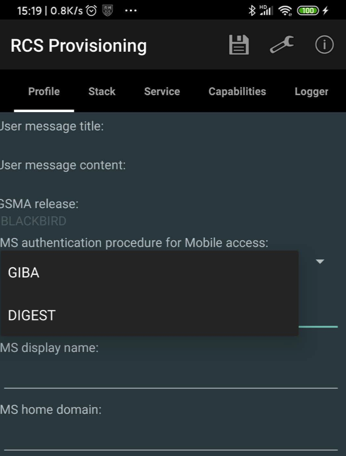
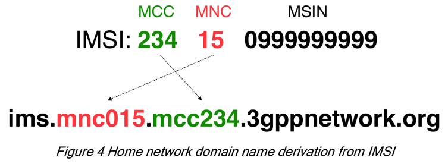

# 核心参数

此处对于`core`即`RCS Provisioning`中的核心参数，主要是`Profile`中的部分参数，进行详细的解释其含义和计算逻辑。

## 参数：IMS authentication procedure for Mobile access

此处的`IMS authentication procedure for Mobile access`是2种可能：

* `GIBA`
* `DIGEST`



下面详细解释背景和如何选择：

IMS认证，属于安全security方面的内容

* Security涉及到
  * IMS authentication
  * SIP confidentiality and integrity
  * `SIP Digest`
  * `SIP Digest with TLS`
  * `GIBA`=`GPRS-IMS-Bundled Authentication`
  * `GAA`=`Generic Authentication Architecture`

其中此处的：

* `DIGEST`=`SIP DIGEST` = `SIP Digest with HTTPS`
  * 不是 `SIP Digest with TLS`
* `GIBA`=`GPRS-IMS-Bundled Authentication`

先直接贴结论：

* RCS的认证，是用的RCS所依赖的IMS的认证
  * RCS认证中是2步认证
    * PS领域(PS domain)的认证 = Network level 认证
    * IMS领域(IMS domain)的认证 = Service Level 认证
  * IMS的认证
    * 有两种
      * `GIBA`
        * 旧手机，比如2G手机，不支持USIM/ISIM的，采用GIBA
          * 简介实现最基本的账号的安全认证
      * （基于HTTP的，SIP协议的）`DIGEST`
        * 对比：另外一种是（基于HTTPS的，即TLS的，SIP协议的DIGEST）
        * 概述：是最新的认证方式
          * 最新手机和终端和账号，一般都用这个

而关于IMS中账号认证的详细逻辑和过程，详见：

[用户和认证 · 移动网络演化史](https://book.crifan.com/books/mobile_network_evolution_history/website/ims/related/user_auth.html)

## 参数：IMS username

此处的`IMS username`=`用户标识`，是`IMS`中用于授权和认证的用户名，相当于账号，

概述：

* IMS系统
  * 用户标识
    * 支持多种方式
      * 其中有IMPI和IMPU，都是一种URI
    * 具体来说
      * 以是数字：Tel URI
        * 举例
          * `tel: +1-555-123-4567`
      * 也可以是字符标识符SIP URI
        * 举例：
          * `sip:john.doe@example.com`
      * SIP address ？

详细解释参见：[用户和认证 · 移动网络演化史](https://book.crifan.com/books/mobile_network_evolution_history/website/ims/related/user_auth.html)

## 参数：IMS home domain

此处先是通过安卓9的安卓手机中获取到IMSI：

```bash
~  adb shell getprop |grep gsm
[gsm.current.phone-type]: [1,1]
[gsm.defaultpdpcontext.active]: [false]
[gsm.network.type]: [Unknown,LTE]
[gsm.operator.alpha]: [中国联通,中国移动]
[gsm.operator.iso-country]: [cn,cn]
[gsm.operator.isroaming]: [false,false]
[gsm.operator.numeric]: [46001,46000]
[gsm.operator.orig.alpha]: [蜗牛移动,中国移动]
[gsm.sim.operator.alpha]: [中国联通,中国移动]
[gsm.sim.operator.iso-country]: [cn,cn]
[gsm.sim.operator.numeric]: [46009,46002]
[gsm.sim.operator.orig.alpha]: [蜗牛移动,CMCC]
[gsm.sim.state]: [LOADED,LOADED]
[gsm.version.baseband]: [MOLY.LR13.R1.TC8.SP.V1.P70,MOLY.LR13.R1.TC8.SP.V1.P70]
[gsm.version.ril-impl]: [android reference-ril 1.0]
[vendor.gsm.external.sim.timeout]: [13,13]
[vendor.gsm.gcf.testmode]: [0]
[vendor.gsm.modem.vsim.capability]: [2,2]
[vendor.gsm.project.baseband]: [XIAOMI_P0MP9_K85V1_64(LWCTG_CUSTOM)]
[vendor.gsm.ril.ct3g]: [0]
[vendor.gsm.ril.ct3g.2]: [0]
[vendor.gsm.ril.eboot]: [0]
[vendor.gsm.ril.fulluicctype]: [USIM]
[vendor.gsm.ril.fulluicctype.2]: [USIM]
[vendor.gsm.ril.uicc.mccmnc]: [46009]
[vendor.gsm.ril.uicc.mccmnc.1]: [46002]
[vendor.gsm.ril.uicctype]: [USIM]
[vendor.gsm.ril.uicctype.2]: [USIM]
[vendor.gsm.sim.retry.pin1]: [3]
[vendor.gsm.sim.retry.pin1.2]: [3]
[vendor.gsm.sim.retry.pin2]: [3]
[vendor.gsm.sim.retry.pin2.2]: [3]
[vendor.gsm.sim.retry.puk1]: [10]
[vendor.gsm.sim.retry.puk1.2]: [10]
[vendor.gsm.sim.retry.puk2]: [10]
[vendor.gsm.sim.retry.puk2.2]: [10]
[vendor.gsm.sim.ril.phbready]: [true,true]
[vendor.gsm.sim.ril.testsim]: [0]
[vendor.gsm.sim.ril.testsim.2]: [0]
[vendor.gsm.sim.slot.lock.card.valid]: [0]
[vendor.gsm.sim.slot.lock.card.valid.2]: [0]
[vendor.gsm.sim.slot.lock.device.lock.remain.count]: [5]
[vendor.gsm.sim.slot.lock.policy]: [3]
[vendor.gsm.sim.slot.lock.service.capability]: [0]
[vendor.gsm.sim.slot.lock.service.capability.2]: [0]
[vendor.gsm.sim.slot.lock.state]: [0]
[vendor.ril.data.gsm_imsi0]: [460099388822228]
[vendor.ril.data.gsm_imsi1]: [460023514643095]
[vendor.ril.data.gsm_mcc_mnc0]: [46009]
[vendor.ril.data.gsm_mcc_mnc1]: [46002]
[vendor.ril.data.gsm_spn0]: [00808717725B79FB52A8FFFFFFFFFFFFFF]
[vendor.ril.data.gsm_spn1]: [00434D4343FFFFFFFFFFFFFFFFFFFFFFFF]
```

对应详细信息是：

* 手机中有2个插槽，对应2个IMEI？
  * [ro.ril.miui.imei0]: [861119047863804]
  * [ro.ril.miui.imei1]: [861119047863812]

其中：

* 联通的卡，（虚拟）运营商是 蜗牛移动
   * 对应手机卡已经有了
     * [gsm.sim.state]: [LOADED]
   * 是：
     * [gsm.sim.operator.iso-country]: [cn]
       * 中国
   * 的
     * [gsm.sim.operator.alpha]: [中国联通]
       * 对应编号是
         * [gsm.sim.operator.numeric]: [46009]
           * 另外还有个类似的：
             * [gsm.operator.numeric]: [46001]
       * 等价于
         * [vendor.gsm.ril.uicc.mccmnc]: [46009]
       * 包括两部分
         * MCC：460
           * 指的是：中国
         * MNC：09
           * 指的是：联通
   * 的
     * [gsm.sim.operator.orig.alpha]: [蜗牛移动]
   * 对应的IMSI是
     * [vendor.ril.data.gsm_imsi0]: [460099388822228]
* 自己的中国移动的手机号，运营商是 中国移动
   * [vendor.ril.data.gsm_mcc_mnc1]: [46002]
     * MCC：460
       * 中国
     * MNC：002
       * 中国移动
   *  [vendor.ril.data.gsm_imsi1]: [460023514643095]
    * IMSI：460023514643095
      * MCC：460
        * 中国
      * MNC：002
        * 中国移动 CMCC
      * MSIN：3514643095
   * [gsm.network.type]: [Unknown,LTE]
     * gsm.network.type=LTE
       * 网络是LTE网络
   * [gsm.operator.alpha]: [中国联通,中国移动]
     * gsm.operator.alpha=中国移动

此处使用其中一个中国移动的手机号的IMSI：

* IMSI：460023514643095
  * MCC：460
    * 中国
  * MNC：002
    * 中国移动 CMCC
  * MSIN：3514643095

根据[用户和认证 · 移动网络演化史](https://book.crifan.com/books/mobile_network_evolution_history/website/ims/related/user_auth.html) 的：



从`IMSI`去生成`IMS home domain`=`IMS home network domain`：

`ims.mnc002.mcc460.3gppnetwork.org`
