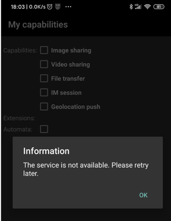
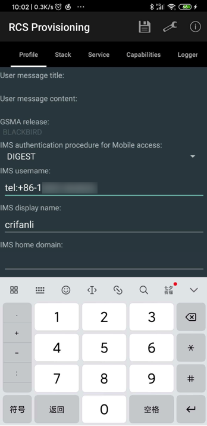

# 演示RCS

已编译安装好RCS的apk后，接着去演示RCS。

在演示之前，需要去 Provisioning开通服务 这个RCS的apk中，设置对应的必要参数，然后才能用于演示RCS服务。

最近进展：没有能够成功的演示RCS的功能，但是搞懂了一些参数配置。

## 无法演示RCS的功能

暂时还没彻底搞清楚，如何才能让RCS服务正常的运行起来。

导致：上述的几个（core，RI，settings等）apk，尝试点击服务，都会出现：

```bash
Information
The service is not available Please retry later
```



折腾过很久，解决了各种编译错误和研究了各种代码逻辑，依旧没解决。

## 需要先配置好核心参数

不过后续搞懂了一些入手的基本逻辑：

要去

* 给`core`=`RCS Provisioning`的apk中的各种参数配置好，才（可）能实现RCS服务正常运行
  * 以及可能还需要：额外的`AS`=`Application Server`，才能确保服务可用。

### 运行RCS是否需要AS？

目前理解是：

此处需要额外的服务器，但（可以不用，不是）AS服务器，而是：`IMS platform`=`IMS平台`

详细解释是： 

* 想要测试RCS协议栈
  * 至少需要
    * IMS platform
      * 可以测试功能：
        * Capabilities
        * Video/Image/Geoloc sharing
        * MM session
    * 在没有AS=AS IM的情况下
      * 也可以测试功能
        * 1-1 chat
        *  File transfer
  * 只有需要
    * AS=IM的AS
      * 才能（完整）测试
        * 1-1 chat
        * Group chat
        * File transfer
* 如何选择IMS platform
  * 开源产品（组合出IMS platform）
    * kamailio
      * 作为：P/I/S-CSCF
    * bind
      * 作为：DNS server
    * FHoSS=Open IMS Core=OpenIMS=OpenIMSCore=Open Source IMS Core
      * 作为：HSS

#### Kamailio

有机会再去折腾：

[Kamailio SIP Server](https://www.kamailio.org/w/)

[tutorials:ims:installation-howto Kamailio SIP Server Wiki](http://www.kamailio.org/wiki/tutorials/ims/installation-howto)

### core中的Profile的部分配置

此处贴出`core`，目前已搞懂的参数：

`RCS Provisioning`中的`Profile`中的一些核心参数：

* IMS authentication procedure for Mobile access
  * `DIGEST`
* IMS username
  * `tel:+86-13812345678`
* IMS display name
  * `crifanli`
* IMS home domain
  * `ims.mnc002.mcc460.3gppnetwork.org`

如图：


