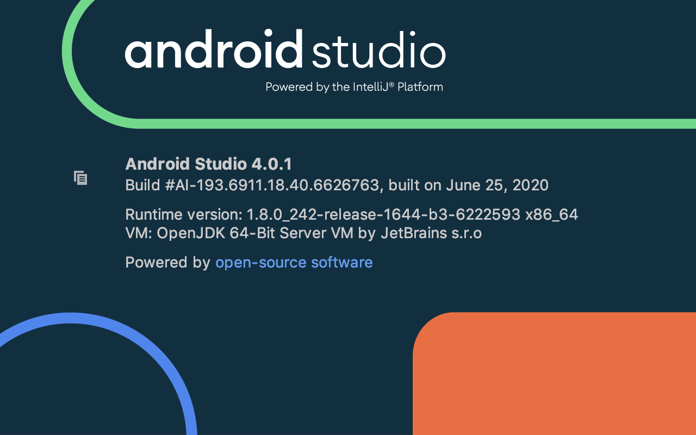

# 准备环境

确保当前系统环境已准备好：

## Java

此处安装的版本是：`1.8.0_212`

相关信息：

```bash
~  java -version
java version "1.8.0_212"
Java(TM) SE Runtime Environment (build 1.8.0_212-b10)
Java HotSpot(TM) 64-Bit Server VM (build 25.212-b10, mixed mode)
```

和：

```bash
/usr/libexec/java_home -V
Matching Java Virtual Machines (1):
    1.8.0_212, x86_64:    "Java SE 8"    /Library/Java/JavaVirtualMachines/jdk1.8.0_212.jdk/Contents/Home

/Library/Java/JavaVirtualMachines/jdk1.8.0_212.jdk/Contents/Home
```

其他说明：

* 记得安装后，把相关环境变量
    ```bash
    export JAVA_HOME=$(/usr/libexec/java_home)
    export PATH=.:$PATH:$JAVA_HOME/bin
    export CLASSPATH=$JAVA_HOME/lib/tools.jar:$JAVA_HOME/lib/dt.jar:.
    ```
    * 加到启动脚本（此处是`.zhsrc`）中
* 如果用VSCode打开`rcsjta`后会提示
  * `Java 11 or more recent is required to run. Please download and install a recent JDK`
    * 
  * 可以忽略不理会

## Android Studio

* 下载
  * 从官网
    * [SDK 平台工具版本说明  |  Android 开发者  |  Android Developers](https://developer.android.com/studio/releases/platform-tools)
    * 得到安装包
      * 此处下载的是`Mac`版`android-studio-ide-193.6626763-mac.dmg`
    * 正常安装即可
    * 最新更新后版本
      * 
      ```bash
      Android Studio 4.0.1
      Build #AI-193.6911.18.40.6626763, built on June 25, 2020
      Runtime version: 1.8.0_242-release-1644-b3-6222593 x86_64
      VM: OpenJDK 64-Bit Server VM by JetBrains s.r.o
      macOS 10.14.6
      GC: ParNew, ConcurrentMarkSweep
      Memory: 1981M
      Cores: 8
      Registry: ide.new.welcome.screen.force=true
      Non-Bundled Plugins: 
      ```
* 设置环境变量
    * 然后把对应变量
        ```bash
        export ANDROID_SDK_ROOT=/Users/limao/Library/Android/sdk
        PATH=$PATH:$ANDROID_SDK_ROOT/build-tools/29.0.2
        PATH=$PATH:$ANDROID_SDK_ROOT/tools:$ANDROID_SDK_ROOT/platform-tools
        ANDROID_HOME=$ANDROID_SDK_ROOT
        ```
    * 加到启动脚本（此处是`~/.zshrc`）中
* 下载`SDK`
  * 然后在`Android Studio`中下载对应所需版本的`SDK`

相关说明：

* 还是要加`ANDROID_HOME`
  * 虽然官网 [环境变量  |  Android 开发者  |  Android Developers](https://developer.android.com/studio/command-line/variables)已解释的很清楚
  * 对于 设置 SDK 安装目录的路径 的环境变量：
    * 旧的：ANDROID_HOME
      * 已废弃
        * 为了兼容，目前也还支持ANDROID_HOME而已
    * 新的：ANDROID_SDK_ROOT
      * 建议用新的
  * 但是上述还是要设置`ANDROID_HOME`
  * 否则就会报错`A problem occurred configuring project SDK location not found`
