# 运行apk

然后去把rcsjta编译出的几个apk安装到安卓手机中：

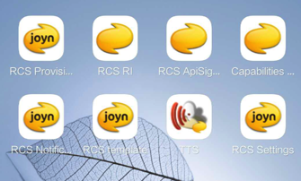

启动看看效果。

## core

core=RCS Stack=带Provisioning开通服务相关配置

core编译出apk安装后：

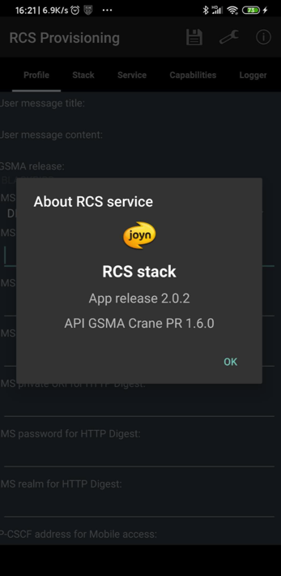

子页面：

* Profile
  * 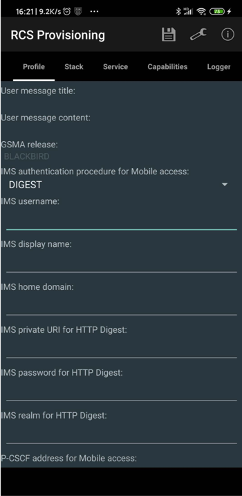
* Stack
  * 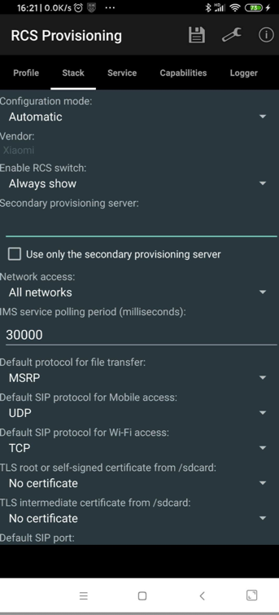
* Service
  * 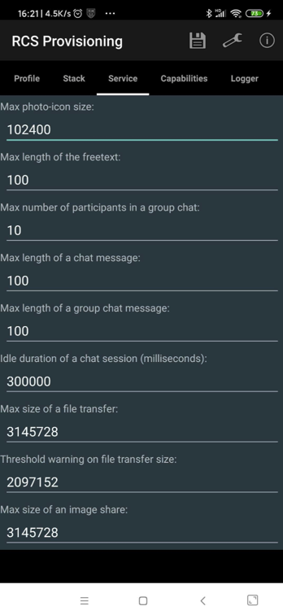
* Capabilities
  * 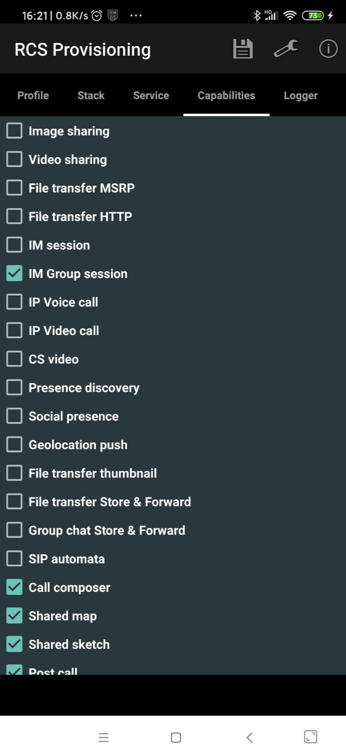
* Logger
  * 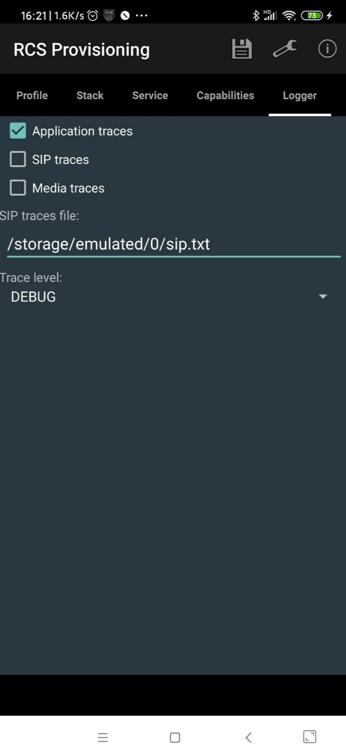

# RI

RI编译出apk安装后：

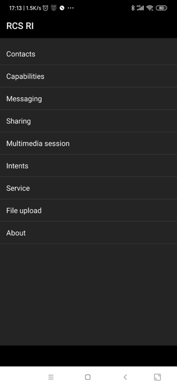

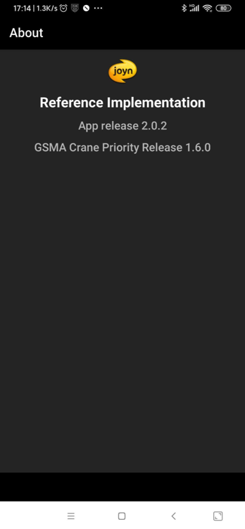

子页面：

* Contacts
  * 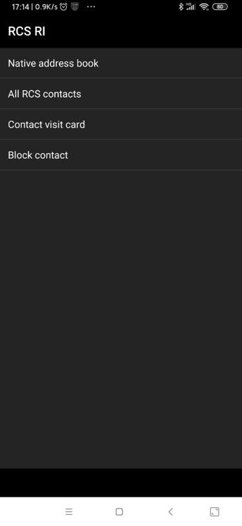
* Capabilities
  * 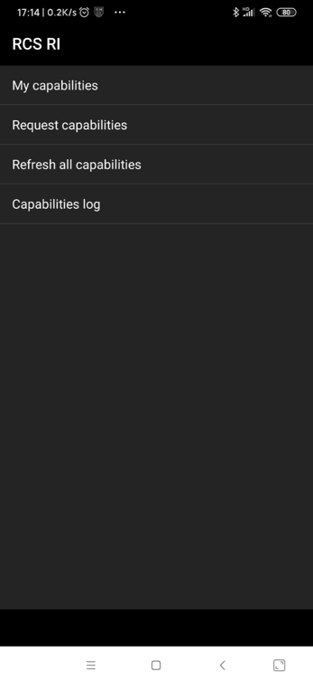
* Messaging
  * 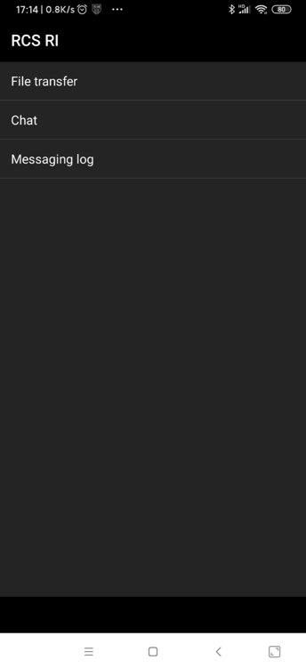
* Sharing
  * 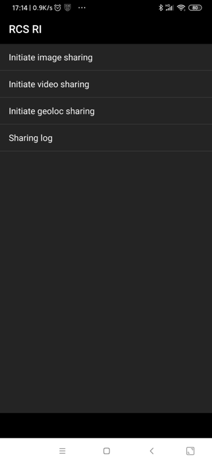
* Multimedia session
  * 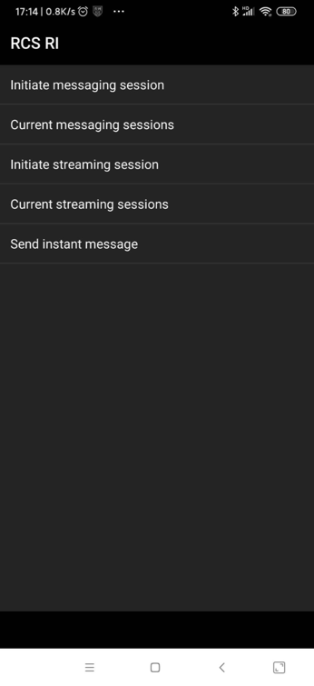
* Intents
  * 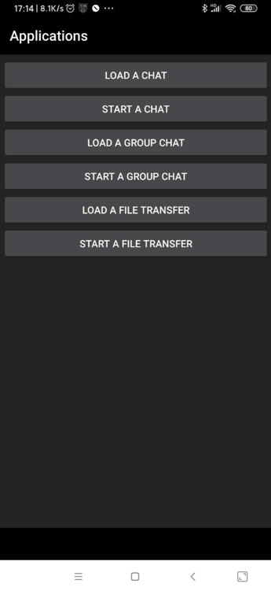
* Service
  * 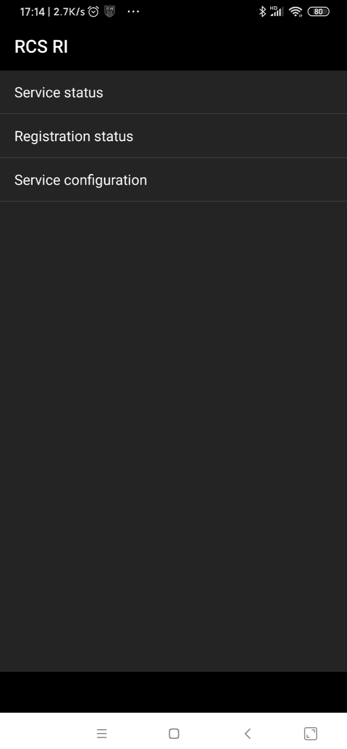
* File upload
  * 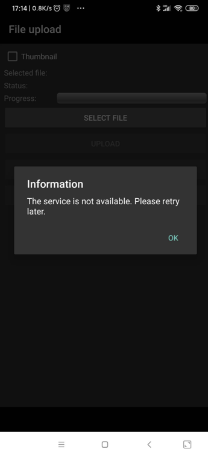

## settings

settings编译出apk安装后：

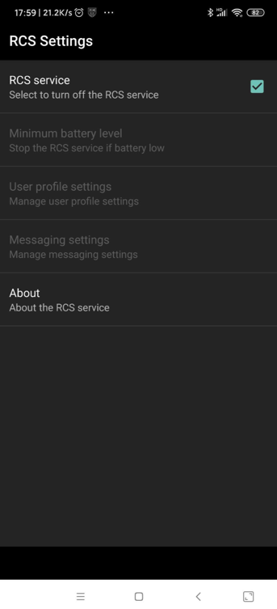

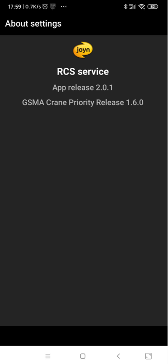

版本是：

```bash
RCS service
App release 2.0.1
GSMA Crane Priority Release 1.6.0
```
